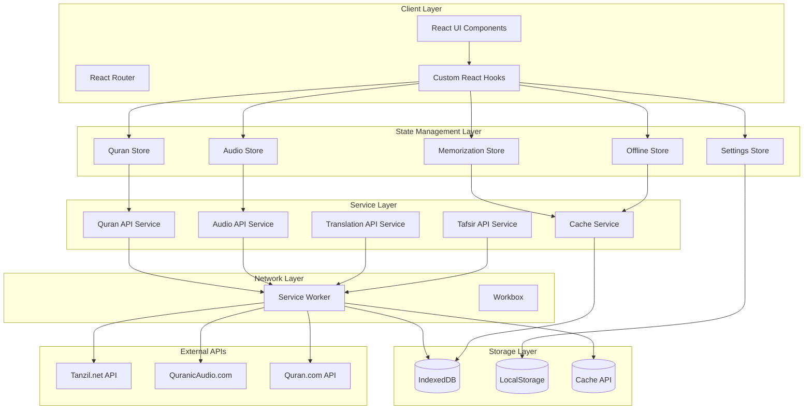
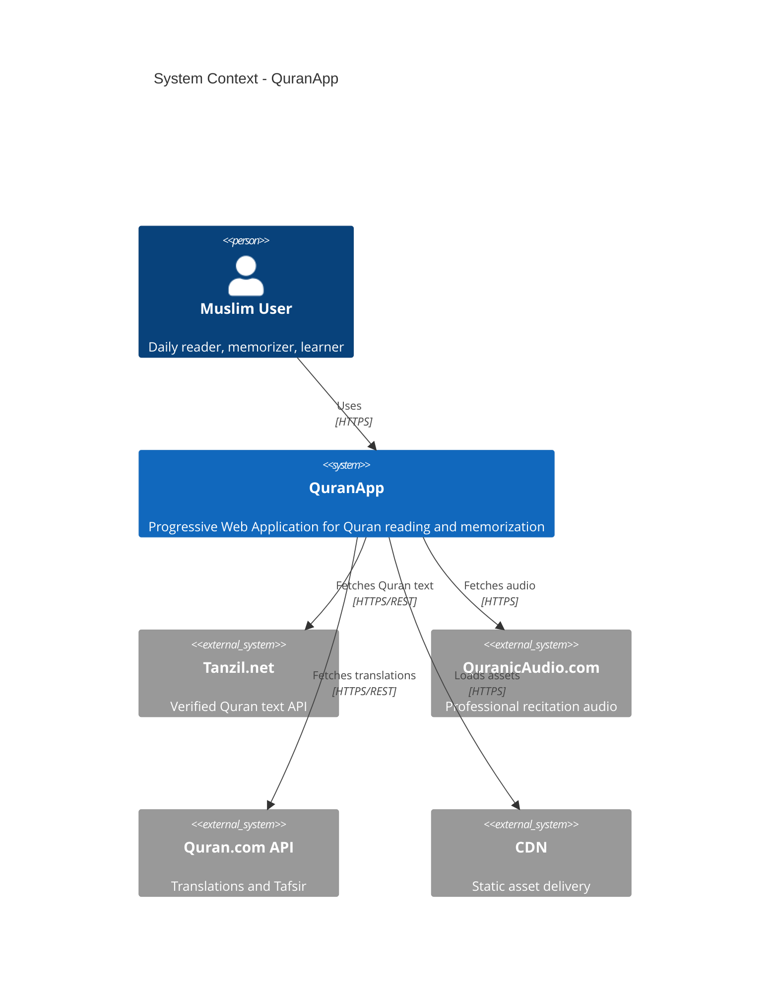
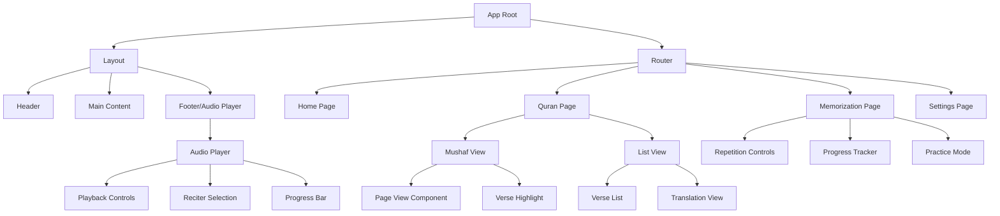
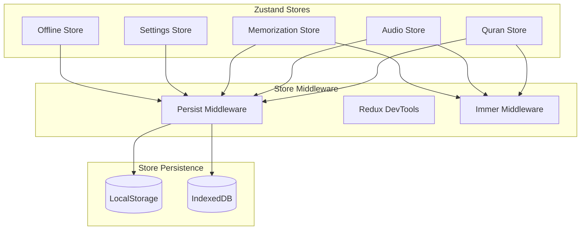
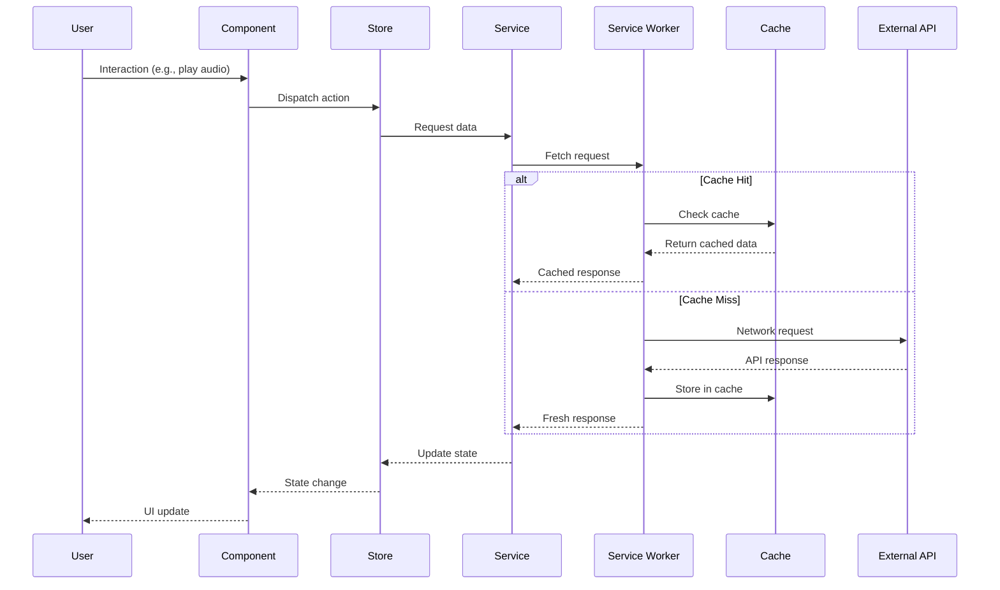
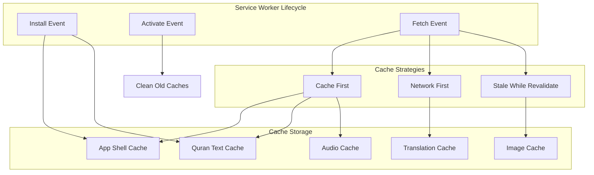
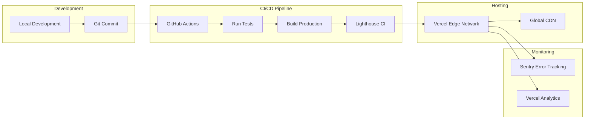

# QuranApp - System Architecture Document

## Document Information

| Field | Value |
|-------|-------|
| **Document Type** | System Architecture Document (SAD) |
| **Version** | 1.0.0 |
| **Status** | Active |
| **Last Updated** | November 2025 |
| **Owner** | Architecture Team |
| **Related Documents** | MVP.md, PRD.md |

## Table of Contents

1. [Architecture Overview](#architecture-overview)
2. [System Context](#system-context)
3. [Technology Stack](#technology-stack)
4. [Component Architecture](#component-architecture)
5. [State Management Architecture](#state-management-architecture)
6. [Data Flow Architecture](#data-flow-architecture)
7. [PWA Architecture](#pwa-architecture)
8. [Performance Optimization](#performance-optimization)
9. [Security Architecture](#security-architecture)
10. [Deployment Architecture](#deployment-architecture)
11. [Development Guidelines](#development-guidelines)

---

## Architecture Overview

### System Architecture Diagram



### Architecture Principles

1. **Offline-First**: All core functionality works without internet
2. **Performance-First**: Sub-3-second load, 60fps interactions
3. **Component-Based**: Reusable, testable React components
4. **Type-Safe**: TypeScript strict mode throughout
5. **Progressive Enhancement**: Graceful degradation for older browsers
6. **Islamic Authenticity**: Content integrity verification at all layers
7. **Accessibility-First**: WCAG 2.1 AA compliance by design
8. **Modular Architecture**: Clear separation of concerns

---

## System Context

### Context Diagram



### Key System Characteristics

| Characteristic | Description | Target |
|----------------|-------------|--------|
| **Type** | Progressive Web Application (PWA) | Installable, offline-capable |
| **Architecture Style** | Client-side SPA with service workers | Offline-first architecture |
| **Primary Users** | 50,000+ Muslims worldwide | Multi-language, multi-device |
| **Deployment** | Edge CDN (Vercel/Netlify) | Global distribution |
| **Data Storage** | Client-side (IndexedDB, Cache API) | No backend database |
| **Performance** | < 3s load, 60fps interactions | Lighthouse > 90 |
| **Availability** | 99.9% uptime | Offline fallback always |

---

## Technology Stack

### Frontend Stack

```yaml
Core Framework:
  React: 18.2+
  TypeScript: 5.0+
  Build Tool: Vite 5.0+

State Management:
  Zustand: 4.4+
  Immer: 10.0+ (for immutable updates)

UI Framework:
  Tailwind CSS: 3.3+
  shadcn/ui: Latest
  Radix UI: Latest (accessible primitives)

Routing:
  React Router: 6.0+

PWA & Offline:
  Workbox: 7.0+
  idb: 7.0+ (IndexedDB wrapper)

Audio:
  Howler.js: 2.2+ (cross-browser audio)

Testing:
  Vitest: Latest (unit tests)
  React Testing Library: Latest
  Playwright: Latest (E2E tests)

Code Quality:
  ESLint: 8.0+
  Prettier: 3.0+
  TypeScript: strict mode
  Husky: Git hooks

Performance:
  Lighthouse CI: Continuous monitoring
  web-vitals: Core Web Vitals tracking
```

### Build & Deployment Stack

```yaml
Package Manager:
  npm: 9.0+

Version Control:
  Git: 2.40+
  GitHub: Repository hosting

CI/CD:
  GitHub Actions: Automated pipelines

Hosting:
  Vercel: Primary (CDN + edge functions)
  Netlify: Backup

Monitoring:
  Sentry: Error tracking
  Vercel Analytics: Performance monitoring

Node Runtime:
  Node.js: 18 LTS
```

### Data Sources

```yaml
Quran Text:
  Primary: Tanzil.net API
  Format: JSON with Uthmani script
  Narration: Hafs 'an 'Asim

Audio:
  Source: QuranicAudio.com
  Format: MP3 (128kbps minimum)
  Reciters: 5+ professional Qaris

Translations:
  Source: Quran.com API
  Languages: 10+ languages
  Translators: Multiple per language

Tafsir:
  Sources: Islamic content repositories
  Classical: Ibn Kathir, Al-Tabari
  Modern: English commentaries
```

---

## Component Architecture

### Component Hierarchy Diagram



### Component Structure

```
src/
├── components/
│   ├── layout/
│   │   ├── Header/
│   │   │   ├── Header.tsx
│   │   │   ├── Navigation.tsx
│   │   │   ├── PositionIndicator.tsx
│   │   │   └── SettingsButton.tsx
│   │   ├── Footer/
│   │   │   └── Footer.tsx
│   │   └── Layout.tsx
│   │
│   ├── quran/
│   │   ├── MushafView/
│   │   │   ├── MushafView.tsx
│   │   │   ├── PageView.tsx
│   │   │   ├── VerseHighlight.tsx
│   │   │   └── PageNavigation.tsx
│   │   ├── ListView/
│   │   │   ├── ListView.tsx
│   │   │   ├── VerseList.tsx
│   │   │   ├── VerseItem.tsx
│   │   │   └── TranslationView.tsx
│   │   ├── Navigation/
│   │   │   ├── SurahNavigator.tsx
│   │   │   ├── JuzNavigator.tsx
│   │   │   ├── PageNavigator.tsx
│   │   │   └── Bookmarks.tsx
│   │   └── Search/
│   │       ├── SearchBar.tsx
│   │       ├── SearchResults.tsx
│   │       └── SearchFilters.tsx
│   │
│   ├── audio/
│   │   ├── AudioPlayer/
│   │   │   ├── AudioPlayer.tsx
│   │   │   ├── PlaybackControls.tsx
│   │   │   ├── ProgressBar.tsx
│   │   │   ├── VolumeControl.tsx
│   │   │   └── SpeedControl.tsx
│   │   ├── ReciterSelection/
│   │   │   ├── ReciterSelect.tsx
│   │   │   └── ReciterCard.tsx
│   │   └── AudioSync/
│   │       ├── VerseSync.tsx
│   │       └── AutoScroll.tsx
│   │
│   ├── memorization/
│   │   ├── RepetitionControls/
│   │   │   ├── RepetitionControls.tsx
│   │   │   ├── RepetitionCounter.tsx
│   │   │   └── RangeSelector.tsx
│   │   ├── ProgressTracker/
│   │   │   ├── ProgressTracker.tsx
│   │   │   ├── ProgressChart.tsx
│   │   │   ├── StreakTracker.tsx
│   │   │   └── Statistics.tsx
│   │   └── PracticeMode/
│   │       ├── PracticeMode.tsx
│   │       ├── HideTextMode.tsx
│   │       ├── FirstWordMode.tsx
│   │       └── QuizMode.tsx
│   │
│   ├── settings/
│   │   ├── SettingsPanel/
│   │   │   ├── SettingsPanel.tsx
│   │   │   ├── DisplaySettings.tsx
│   │   │   ├── AudioSettings.tsx
│   │   │   ├── MemorizationSettings.tsx
│   │   │   └── NotificationSettings.tsx
│   │   └── ThemeToggle/
│   │       └── ThemeToggle.tsx
│   │
│   └── common/
│       ├── Button/
│       │   └── Button.tsx
│       ├── Modal/
│       │   └── Modal.tsx
│       ├── Loading/
│       │   ├── Spinner.tsx
│       │   └── Skeleton.tsx
│       ├── ErrorBoundary/
│       │   └── ErrorBoundary.tsx
│       └── Notification/
│           └── Toast.tsx
│
├── pages/
│   ├── Home.tsx
│   ├── QuranReader.tsx
│   ├── Memorization.tsx
│   ├── Settings.tsx
│   └── NotFound.tsx
```

### Component Design Patterns

#### 1. Container/Presenter Pattern

```typescript
// Container Component (connects to store)
export const MushafViewContainer: React.FC = () => {
  const { currentPage, verses } = useQuranStore();
  const { isPlaying, currentVerse } = useAudioStore();

  return (
    <MushafView
      page={currentPage}
      verses={verses}
      currentVerse={currentVerse}
      isPlaying={isPlaying}
    />
  );
};

// Presenter Component (pure, receives props)
export const MushafView: React.FC<MushafViewProps> = ({
  page,
  verses,
  currentVerse,
  isPlaying
}) => {
  return (
    <div className="mushaf-view">
      {verses.map(verse => (
        <VerseItem
          key={verse.id}
          verse={verse}
          isActive={verse.id === currentVerse}
          isPlaying={isPlaying}
        />
      ))}
    </div>
  );
};
```

#### 2. Compound Components Pattern

```typescript
// Audio Player with compound components
export const AudioPlayer = {
  Root: AudioPlayerRoot,
  Controls: PlaybackControls,
  Progress: ProgressBar,
  Volume: VolumeControl,
  ReciterSelect: ReciterSelection,
};

// Usage
<AudioPlayer.Root>
  <AudioPlayer.ReciterSelect />
  <AudioPlayer.Controls />
  <AudioPlayer.Progress />
  <AudioPlayer.Volume />
</AudioPlayer.Root>
```

#### 3. Render Props Pattern

```typescript
// Flexible data fetching
export const QuranData: React.FC<{
  surah: number;
  children: (data: QuranDataProps) => React.ReactNode;
}> = ({ surah, children }) => {
  const { verses, loading, error } = useQuranData(surah);

  return children({ verses, loading, error });
};

// Usage
<QuranData surah={1}>
  {({ verses, loading, error }) => (
    loading ? <Spinner /> :
    error ? <ErrorMessage /> :
    <VerseList verses={verses} />
  )}
</QuranData>
```

---

## State Management Architecture

### Zustand Store Architecture



### Store Definitions

#### 1. Quran Store

```typescript
// stores/quranStore.ts
interface QuranState {
  // Current position
  currentSurah: number;
  currentVerse: number;
  currentPage: number;
  currentJuz: number;

  // Quran data
  verses: Verse[];
  surahs: Surah[];

  // View mode
  viewMode: 'mushaf' | 'list';

  // Bookmarks
  bookmarks: Bookmark[];
  lastReadPosition: Position;

  // Actions
  setCurrentPosition: (position: Position) => void;
  loadVerses: (surah: number) => Promise<void>;
  addBookmark: (bookmark: Bookmark) => void;
  removeBookmark: (id: string) => void;
  setViewMode: (mode: 'mushaf' | 'list') => void;
}

export const useQuranStore = create<QuranState>()(
  persist(
    immer((set, get) => ({
      currentSurah: 1,
      currentVerse: 1,
      currentPage: 1,
      currentJuz: 1,
      verses: [],
      surahs: [],
      viewMode: 'mushaf',
      bookmarks: [],
      lastReadPosition: { surah: 1, verse: 1, page: 1 },

      setCurrentPosition: (position) =>
        set((state) => {
          state.currentSurah = position.surah;
          state.currentVerse = position.verse;
          state.currentPage = position.page;
          state.lastReadPosition = position;
        }),

      loadVerses: async (surah) => {
        const verses = await quranAPI.getVerses(surah);
        set((state) => {
          state.verses = verses;
        });
      },

      addBookmark: (bookmark) =>
        set((state) => {
          state.bookmarks.push(bookmark);
        }),

      removeBookmark: (id) =>
        set((state) => {
          state.bookmarks = state.bookmarks.filter(b => b.id !== id);
        }),

      setViewMode: (mode) =>
        set((state) => {
          state.viewMode = mode;
        }),
    })),
    {
      name: 'quran-store',
      storage: createJSONStorage(() => localStorage),
    }
  )
);
```

#### 2. Audio Store

```typescript
// stores/audioStore.ts
interface AudioState {
  // Playback state
  isPlaying: boolean;
  currentReciter: string;
  currentVerse: number;
  playbackSpeed: number;
  volume: number;

  // Repeat settings
  repeatMode: 'none' | 'verse' | 'range' | 'surah';
  repeatCount: number;
  currentRepetition: number;

  // Audio data
  reciters: Reciter[];
  audioQueue: AudioSegment[];

  // Actions
  play: () => void;
  pause: () => void;
  skipNext: () => void;
  skipPrevious: () => void;
  setReciter: (reciterId: string) => void;
  setPlaybackSpeed: (speed: number) => void;
  setVolume: (volume: number) => void;
  setRepeatMode: (mode: RepeatMode) => void;
  setRepeatCount: (count: number) => void;
}

export const useAudioStore = create<AudioState>()(
  persist(
    immer((set, get) => ({
      isPlaying: false,
      currentReciter: 'mishary',
      currentVerse: 1,
      playbackSpeed: 1.0,
      volume: 1.0,
      repeatMode: 'none',
      repeatCount: 1,
      currentRepetition: 0,
      reciters: [],
      audioQueue: [],

      play: () => set({ isPlaying: true }),
      pause: () => set({ isPlaying: false }),

      skipNext: () =>
        set((state) => {
          if (state.currentRepetition < state.repeatCount - 1) {
            state.currentRepetition++;
          } else {
            state.currentVerse++;
            state.currentRepetition = 0;
          }
        }),

      skipPrevious: () =>
        set((state) => {
          if (state.currentVerse > 1) {
            state.currentVerse--;
            state.currentRepetition = 0;
          }
        }),

      setReciter: (reciterId) =>
        set({ currentReciter: reciterId }),

      setPlaybackSpeed: (speed) =>
        set({ playbackSpeed: speed }),

      setVolume: (volume) =>
        set({ volume }),

      setRepeatMode: (mode) =>
        set({ repeatMode: mode }),

      setRepeatCount: (count) =>
        set({ repeatCount: count, currentRepetition: 0 }),
    })),
    {
      name: 'audio-store',
      storage: createJSONStorage(() => localStorage),
    }
  )
);
```

#### 3. Memorization Store

```typescript
// stores/memorizationStore.ts
interface MemorizationState {
  // Progress data
  memorizedVerses: Set<string>;
  verseProgress: Map<string, VerseProgress>;
  dailyGoal: number;
  currentStreak: number;
  longestStreak: number;

  // Practice settings
  practiceMode: 'hide-text' | 'first-word' | 'quiz';
  selectedRange: VerseRange;

  // Statistics
  totalTimeSpent: number; // in minutes
  versesMemorizedToday: number;
  lastPracticeDate: Date | null;

  // Actions
  markVerseMemorized: (verseId: string) => void;
  updateVerseProgress: (verseId: string, progress: VerseProgress) => void;
  setDailyGoal: (goal: number) => void;
  setPracticeMode: (mode: PracticeMode) => void;
  updateStreak: () => void;
  recordPracticeTime: (minutes: number) => void;
}

export const useMemorizationStore = create<MemorizationState>()(
  persist(
    immer((set, get) => ({
      memorizedVerses: new Set<string>(),
      verseProgress: new Map(),
      dailyGoal: 5,
      currentStreak: 0,
      longestStreak: 0,
      practiceMode: 'hide-text',
      selectedRange: { start: 1, end: 7 },
      totalTimeSpent: 0,
      versesMemorizedToday: 0,
      lastPracticeDate: null,

      markVerseMemorized: (verseId) =>
        set((state) => {
          state.memorizedVerses.add(verseId);
          state.versesMemorizedToday++;
        }),

      updateVerseProgress: (verseId, progress) =>
        set((state) => {
          state.verseProgress.set(verseId, progress);
        }),

      setDailyGoal: (goal) =>
        set({ dailyGoal: goal }),

      setPracticeMode: (mode) =>
        set({ practiceMode: mode }),

      updateStreak: () =>
        set((state) => {
          const today = new Date().toDateString();
          const lastDate = state.lastPracticeDate?.toDateString();

          if (today === lastDate) {
            return; // Already practiced today
          }

          const yesterday = new Date();
          yesterday.setDate(yesterday.getDate() - 1);

          if (lastDate === yesterday.toDateString()) {
            state.currentStreak++;
          } else {
            state.currentStreak = 1;
          }

          state.longestStreak = Math.max(
            state.longestStreak,
            state.currentStreak
          );
          state.lastPracticeDate = new Date();
        }),

      recordPracticeTime: (minutes) =>
        set((state) => {
          state.totalTimeSpent += minutes;
        }),
    })),
    {
      name: 'memorization-store',
      storage: createJSONStorage(() => localStorage),
    }
  )
);
```

#### 4. Settings Store

```typescript
// stores/settingsStore.ts
interface SettingsState {
  // Display settings
  theme: 'light' | 'dark' | 'sepia' | 'auto';
  fontSize: 'small' | 'medium' | 'large' | 'xlarge';
  fontFamily: 'amiri' | 'kfgqpc' | 'traditional';
  tajweedColoring: boolean;

  // Translation settings
  selectedTranslations: string[];
  translationPosition: 'below' | 'beside';

  // Notification settings
  dailyReminderEnabled: boolean;
  dailyReminderTime: string;
  memorizationReviewEnabled: boolean;

  // Actions
  setTheme: (theme: Theme) => void;
  setFontSize: (size: FontSize) => void;
  setFontFamily: (family: FontFamily) => void;
  toggleTajweedColoring: () => void;
  setSelectedTranslations: (translations: string[]) => void;
  setTranslationPosition: (position: 'below' | 'beside') => void;
  setDailyReminder: (enabled: boolean, time: string) => void;
}

export const useSettingsStore = create<SettingsState>()(
  persist(
    (set) => ({
      theme: 'auto',
      fontSize: 'medium',
      fontFamily: 'amiri',
      tajweedColoring: true,
      selectedTranslations: ['en.sahih'],
      translationPosition: 'below',
      dailyReminderEnabled: false,
      dailyReminderTime: '08:00',
      memorizationReviewEnabled: true,

      setTheme: (theme) => set({ theme }),
      setFontSize: (size) => set({ fontSize: size }),
      setFontFamily: (family) => set({ fontFamily: family }),
      toggleTajweedColoring: () =>
        set((state) => ({ tajweedColoring: !state.tajweedColoring })),
      setSelectedTranslations: (translations) =>
        set({ selectedTranslations: translations }),
      setTranslationPosition: (position) =>
        set({ translationPosition: position }),
      setDailyReminder: (enabled, time) =>
        set({ dailyReminderEnabled: enabled, dailyReminderTime: time }),
    }),
    {
      name: 'settings-store',
      storage: createJSONStorage(() => localStorage),
    }
  )
);
```

#### 5. Offline Store

```typescript
// stores/offlineStore.ts
interface OfflineState {
  // Download status
  downloadQueue: Download[];
  activeDownloads: Map<string, DownloadProgress>;
  cachedSurahs: Set<number>;
  cachedReciters: Set<string>;

  // Storage info
  totalStorageUsed: number;
  storageQuota: number;

  // Actions
  addToQueue: (download: Download) => void;
  removeFromQueue: (id: string) => void;
  updateProgress: (id: string, progress: number) => void;
  markAsCached: (type: 'surah' | 'reciter', id: string | number) => void;
  clearCache: (type?: 'audio' | 'text' | 'all') => Promise<void>;
  calculateStorage: () => Promise<void>;
}

export const useOfflineStore = create<OfflineState>()(
  persist(
    immer((set, get) => ({
      downloadQueue: [],
      activeDownloads: new Map(),
      cachedSurahs: new Set<number>(),
      cachedReciters: new Set<string>(),
      totalStorageUsed: 0,
      storageQuota: 0,

      addToQueue: (download) =>
        set((state) => {
          state.downloadQueue.push(download);
        }),

      removeFromQueue: (id) =>
        set((state) => {
          state.downloadQueue = state.downloadQueue.filter(d => d.id !== id);
        }),

      updateProgress: (id, progress) =>
        set((state) => {
          state.activeDownloads.set(id, { ...state.activeDownloads.get(id), progress });
        }),

      markAsCached: (type, id) =>
        set((state) => {
          if (type === 'surah') {
            state.cachedSurahs.add(id as number);
          } else {
            state.cachedReciters.add(id as string);
          }
        }),

      clearCache: async (type = 'all') => {
        await cacheService.clearCache(type);
        set((state) => {
          if (type === 'audio' || type === 'all') {
            state.cachedSurahs.clear();
            state.cachedReciters.clear();
          }
        });
        get().calculateStorage();
      },

      calculateStorage: async () => {
        const { usage, quota } = await navigator.storage.estimate();
        set({
          totalStorageUsed: usage || 0,
          storageQuota: quota || 0,
        });
      },
    })),
    {
      name: 'offline-store',
      storage: createJSONStorage(() => localStorage),
    }
  )
);
```

---

## Data Flow Architecture

### Data Flow Diagram



### Request Flow Patterns

#### 1. Offline-First Pattern

```typescript
// services/quranAPI.ts
export class QuranAPIService {
  async getVerses(surah: number): Promise<Verse[]> {
    try {
      // 1. Try cache first
      const cached = await this.getCachedVerses(surah);
      if (cached) {
        // Return cached immediately
        this.updateInBackground(surah); // Update in background
        return cached;
      }

      // 2. Fetch from network
      const verses = await this.fetchFromNetwork(surah);

      // 3. Cache for offline use
      await this.cacheVerses(surah, verses);

      return verses;
    } catch (error) {
      // 4. Fallback to cache if network fails
      const cached = await this.getCachedVerses(surah);
      if (cached) {
        return cached;
      }
      throw error;
    }
  }

  private async getCachedVerses(surah: number): Promise<Verse[] | null> {
    const db = await this.openDB();
    return db.get('verses', surah);
  }

  private async fetchFromNetwork(surah: number): Promise<Verse[]> {
    const response = await fetch(`/api/quran/surah/${surah}`);
    if (!response.ok) throw new Error('Network request failed');
    return response.json();
  }

  private async cacheVerses(surah: number, verses: Verse[]): Promise<void> {
    const db = await this.openDB();
    await db.put('verses', verses, surah);
  }

  private async updateInBackground(surah: number): Promise<void> {
    try {
      const verses = await this.fetchFromNetwork(surah);
      await this.cacheVerses(surah, verses);
    } catch (error) {
      // Silent fail - user already has cached data
      console.warn('Background update failed:', error);
    }
  }
}
```

#### 2. Audio Streaming Pattern

```typescript
// services/audioService.ts
export class AudioService {
  private howl: Howl | null = null;

  async playVerse(reciter: string, surah: number, verse: number): Promise<void> {
    // 1. Get audio URL (from cache or network)
    const audioUrl = await this.getAudioUrl(reciter, surah, verse);

    // 2. Create Howl instance with caching
    this.howl = new Howl({
      src: [audioUrl],
      html5: true, // Enable streaming
      preload: true,
      onload: () => this.onAudioLoad(),
      onplay: () => this.onAudioPlay(),
      onend: () => this.onAudioEnd(),
      onerror: (id, error) => this.onAudioError(error),
    });

    // 3. Start playback
    this.howl.play();
  }

  private async getAudioUrl(
    reciter: string,
    surah: number,
    verse: number
  ): Promise<string> {
    const cacheKey = `audio-${reciter}-${surah}-${verse}`;

    // Try cache first
    const cached = await caches.match(cacheKey);
    if (cached) {
      return URL.createObjectURL(await cached.blob());
    }

    // Fallback to CDN
    return `https://cdn.quranicaudio.com/${reciter}/${surah}/${verse}.mp3`;
  }

  private onAudioLoad(): void {
    // Notify store that audio is ready
    useAudioStore.getState().setAudioLoaded(true);
  }

  private onAudioPlay(): void {
    // Sync UI with playback
    useAudioStore.getState().setIsPlaying(true);
  }

  private onAudioEnd(): void {
    // Handle repetition or next verse
    const { repeatMode, currentRepetition, repeatCount } = useAudioStore.getState();

    if (repeatMode === 'verse' && currentRepetition < repeatCount - 1) {
      // Repeat current verse
      this.howl?.seek(0);
      this.howl?.play();
      useAudioStore.getState().incrementRepetition();
    } else {
      // Move to next verse
      useAudioStore.getState().skipNext();
    }
  }

  private onAudioError(error: any): void {
    console.error('Audio playback error:', error);
    // Fallback to next available reciter or show error
  }
}
```

---

## PWA Architecture

### Service Worker Strategy



### Service Worker Implementation

```typescript
// service-worker.ts
import { precacheAndRoute } from 'workbox-precaching';
import { registerRoute } from 'workbox-routing';
import {
  CacheFirst,
  NetworkFirst,
  StaleWhileRevalidate,
} from 'workbox-strategies';
import { CacheableResponsePlugin } from 'workbox-cacheable-response';
import { ExpirationPlugin } from 'workbox-expiration';

// Precache app shell and static assets
precacheAndRoute(self.__WB_MANIFEST);

// Cache Strategy 1: App Shell - Cache First
registerRoute(
  ({ request }) =>
    request.destination === 'document' ||
    request.destination === 'script' ||
    request.destination === 'style',
  new CacheFirst({
    cacheName: 'app-shell-v1',
    plugins: [
      new CacheableResponsePlugin({
        statuses: [0, 200],
      }),
    ],
  })
);

// Cache Strategy 2: Quran Text - Cache First with Background Update
registerRoute(
  ({ url }) => url.pathname.startsWith('/api/quran/'),
  new CacheFirst({
    cacheName: 'quran-text-v1',
    plugins: [
      new CacheableResponsePlugin({
        statuses: [0, 200],
      }),
      new ExpirationPlugin({
        maxEntries: 114, // All Surahs
        maxAgeSeconds: 30 * 24 * 60 * 60, // 30 days
      }),
    ],
  })
);

// Cache Strategy 3: Audio - Cache First (User Initiated)
registerRoute(
  ({ url }) =>
    url.hostname.includes('quranicaudio.com') &&
    url.pathname.endsWith('.mp3'),
  new CacheFirst({
    cacheName: 'audio-cache-v1',
    plugins: [
      new CacheableResponsePlugin({
        statuses: [0, 200],
      }),
      new ExpirationPlugin({
        maxEntries: 600, // ~10 Surahs × 60 verses average
        maxAgeSeconds: 90 * 24 * 60 * 60, // 90 days
      }),
    ],
  })
);

// Cache Strategy 4: Translations - Stale While Revalidate
registerRoute(
  ({ url }) => url.pathname.startsWith('/api/translations/'),
  new StaleWhileRevalidate({
    cacheName: 'translations-v1',
    plugins: [
      new CacheableResponsePlugin({
        statuses: [0, 200],
      }),
      new ExpirationPlugin({
        maxEntries: 50,
        maxAgeSeconds: 7 * 24 * 60 * 60, // 7 days
      }),
    ],
  })
);

// Cache Strategy 5: Images - Stale While Revalidate
registerRoute(
  ({ request }) => request.destination === 'image',
  new StaleWhileRevalidate({
    cacheName: 'image-cache-v1',
    plugins: [
      new CacheableResponsePlugin({
        statuses: [0, 200],
      }),
      new ExpirationPlugin({
        maxEntries: 100,
        maxAgeSeconds: 30 * 24 * 60 * 60, // 30 days
      }),
    ],
  })
);

// Background Sync for offline actions
self.addEventListener('sync', (event: any) => {
  if (event.tag === 'sync-bookmarks') {
    event.waitUntil(syncBookmarks());
  }
  if (event.tag === 'sync-progress') {
    event.waitUntil(syncMemorizationProgress());
  }
});

// Push Notifications
self.addEventListener('push', (event: any) => {
  const data = event.data.json();

  event.waitUntil(
    self.registration.showNotification(data.title, {
      body: data.body,
      icon: '/icons/icon-192x192.png',
      badge: '/icons/badge-72x72.png',
      vibrate: [200, 100, 200],
    })
  );
});

// Notification Click Handler
self.addEventListener('notificationclick', (event: any) => {
  event.notification.close();

  event.waitUntil(
    clients.openWindow(event.notification.data.url || '/')
  );
});
```

### PWA Manifest

```json
{
  "name": "QuranApp - Quran Reader & Memorization",
  "short_name": "QuranApp",
  "description": "Read, listen, and memorize the Holy Quran with authentic text and professional audio",
  "start_url": "/",
  "display": "standalone",
  "background_color": "#FAFAFA",
  "theme_color": "#1B5E20",
  "orientation": "portrait-primary",
  "icons": [
    {
      "src": "/icons/icon-72x72.png",
      "sizes": "72x72",
      "type": "image/png",
      "purpose": "any maskable"
    },
    {
      "src": "/icons/icon-96x96.png",
      "sizes": "96x96",
      "type": "image/png",
      "purpose": "any maskable"
    },
    {
      "src": "/icons/icon-128x128.png",
      "sizes": "128x128",
      "type": "image/png",
      "purpose": "any maskable"
    },
    {
      "src": "/icons/icon-144x144.png",
      "sizes": "144x144",
      "type": "image/png",
      "purpose": "any maskable"
    },
    {
      "src": "/icons/icon-152x152.png",
      "sizes": "152x152",
      "type": "image/png",
      "purpose": "any maskable"
    },
    {
      "src": "/icons/icon-192x192.png",
      "sizes": "192x192",
      "type": "image/png",
      "purpose": "any maskable"
    },
    {
      "src": "/icons/icon-384x384.png",
      "sizes": "384x384",
      "type": "image/png",
      "purpose": "any maskable"
    },
    {
      "src": "/icons/icon-512x512.png",
      "sizes": "512x512",
      "type": "image/png",
      "purpose": "any maskable"
    }
  ],
  "categories": ["education", "lifestyle", "books"],
  "screenshots": [
    {
      "src": "/screenshots/mobile-1.png",
      "sizes": "750x1334",
      "type": "image/png",
      "platform": "narrow"
    },
    {
      "src": "/screenshots/desktop-1.png",
      "sizes": "1920x1080",
      "type": "image/png",
      "platform": "wide"
    }
  ],
  "shortcuts": [
    {
      "name": "Continue Reading",
      "short_name": "Continue",
      "description": "Resume from last position",
      "url": "/continue",
      "icons": [{ "src": "/icons/continue-96x96.png", "sizes": "96x96" }]
    },
    {
      "name": "Memorization",
      "short_name": "Memorize",
      "description": "Practice memorization",
      "url": "/memorization",
      "icons": [{ "src": "/icons/memorize-96x96.png", "sizes": "96x96" }]
    }
  ]
}
```

---

## Performance Optimization

### Performance Architecture

```mermaid
graph TD
    subgraph "Load Performance"
        CodeSplit[Code Splitting]
        LazyLoad[Lazy Loading]
        TreeShake[Tree Shaking]
        Minify[Minification]
    end

    subgraph "Runtime Performance"
        Memo[React.memo]
        UseMemo[useMemo]
        UseCallback[useCallback]
        VirtualScroll[Virtual Scrolling]
    end

    subgraph "Asset Optimization"
        ImageOpt[Image Optimization]
        FontSubset[Font Subsetting]
        GZIP[GZIP Compression]
        Brotli[Brotli Compression]
    end

    subgraph "Caching"
        BrowserCache[Browser Cache]
        ServiceWorker[Service Worker Cache]
        CDN[CDN Caching]
    end

    CodeSplit --> LazyLoad
    LazyLoad --> TreeShake
    TreeShake --> Minify

    Memo --> UseMemo
    UseMemo --> UseCallback
    UseCallback --> VirtualScroll

    ImageOpt --> FontSubset
    FontSubset --> GZIP
    GZIP --> Brotli

    BrowserCache --> ServiceWorker
    ServiceWorker --> CDN
```



### Performance Optimization Strategies

#### 1. Code Splitting & Lazy Loading

```typescript
// src/App.tsx
import { lazy, Suspense } from 'react';
import { Routes, Route } from 'react-router-dom';
import { LoadingSpinner } from './components/common/Loading';

// Lazy load page components
const HomePage = lazy(() => import('./pages/Home'));
const QuranReader = lazy(() => import('./pages/QuranReader'));
const Memorization = lazy(() => import('./pages/Memorization'));
const Settings = lazy(() => import('./pages/Settings'));

function App() {
  return (
    <Suspense fallback={<LoadingSpinner />}>
      <Routes>
        <Route path="/" element={<HomePage />} />
        <Route path="/quran" element={<QuranReader />} />
        <Route path="/memorization" element={<Memorization />} />
        <Route path="/settings" element={<Settings />} />
      </Routes>
    </Suspense>
  );
}
```

#### 2. Virtual Scrolling for Long Lists

```typescript
// components/quran/ListView/VirtualizedVerseList.tsx
import { useVirtualizer } from '@tanstack/react-virtual';

export const VirtualizedVerseList: React.FC<{ verses: Verse[] }> = ({
  verses,
}) => {
  const parentRef = useRef<HTMLDivElement>(null);

  const virtualizer = useVirtualizer({
    count: verses.length,
    getScrollElement: () => parentRef.current,
    estimateSize: () => 100, // Estimated verse height
    overscan: 5, // Render 5 items outside viewport
  });

  return (
    <div ref={parentRef} className="verse-list-container">
      <div
        style={{
          height: `${virtualizer.getTotalSize()}px`,
          position: 'relative',
        }}
      >
        {virtualizer.getVirtualItems().map((virtualRow) => {
          const verse = verses[virtualRow.index];
          return (
            <div
              key={virtualRow.key}
              style={{
                position: 'absolute',
                top: 0,
                left: 0,
                width: '100%',
                transform: `translateY(${virtualRow.start}px)`,
              }}
            >
              <VerseItem verse={verse} />
            </div>
          );
        })}
      </div>
    </div>
  );
};
```

#### 3. Memoization Strategies

```typescript
// components/quran/MushafView/VerseItem.tsx
import { memo, useMemo, useCallback } from 'react';

interface VerseItemProps {
  verse: Verse;
  isActive: boolean;
  onVerseClick: (verseId: number) => void;
}

export const VerseItem = memo<VerseItemProps>(
  ({ verse, isActive, onVerseClick }) => {
    // Memoize expensive computations
    const formattedText = useMemo(() => {
      return formatArabicText(verse.text);
    }, [verse.text]);

    // Memoize event handlers
    const handleClick = useCallback(() => {
      onVerseClick(verse.id);
    }, [verse.id, onVerseClick]);

    return (
      <div
        className={cn('verse-item', { active: isActive })}
        onClick={handleClick}
      >
        <p className="arabic-text">{formattedText}</p>
        <span className="verse-number">{verse.verse}</span>
      </div>
    );
  },
  // Custom comparison function
  (prevProps, nextProps) =>
    prevProps.verse.id === nextProps.verse.id &&
    prevProps.isActive === nextProps.isActive
);
```

#### 4. Asset Optimization

```typescript
// vite.config.ts
import { defineConfig } from 'vite';
import react from '@vitejs/plugin-react';
import { VitePWA } from 'vite-plugin-pwa';
import { imagetools } from 'vite-imagetools';

export default defineConfig({
  plugins: [
    react(),
    imagetools({
      defaultDirectives: (url) => {
        // Optimize images on build
        if (url.searchParams.has('responsive')) {
          return new URLSearchParams({
            format: 'webp',
            quality: '80',
            width: '800;1200;1600',
          });
        }
        return new URLSearchParams();
      },
    }),
    VitePWA({
      registerType: 'autoUpdate',
      includeAssets: ['fonts/*.woff2', 'icons/*.png'],
      manifest: {
        // ... manifest config
      },
      workbox: {
        runtimeCaching: [
          // ... runtime caching strategies
        ],
        maximumFileSizeToCacheInBytes: 5000000, // 5MB
      },
    }),
  ],
  build: {
    rollupOptions: {
      output: {
        manualChunks: {
          // Split vendor chunks
          'react-vendor': ['react', 'react-dom', 'react-router-dom'],
          'ui-vendor': ['@radix-ui/react-dialog', '@radix-ui/react-dropdown-menu'],
          'audio-vendor': ['howler'],
        },
      },
    },
    chunkSizeWarningLimit: 1000, // 1MB warning threshold
  },
});
```

### Performance Monitoring

```typescript
// utils/performance.ts
import { onCLS, onFID, onFCP, onLCP, onTTFB } from 'web-vitals';

export function reportWebVitals() {
  onCLS(sendToAnalytics);
  onFID(sendToAnalytics);
  onFCP(sendToAnalytics);
  onLCP(sendToAnalytics);
  onTTFB(sendToAnalytics);
}

function sendToAnalytics(metric: any) {
  // Send to analytics service
  console.log(metric);

  // Optional: Send to monitoring service
  if (import.meta.env.PROD) {
    // Sentry, Vercel Analytics, etc.
  }
}

// Performance marks for custom metrics
export function markPerformance(name: string) {
  performance.mark(name);
}

export function measurePerformance(name: string, startMark: string, endMark: string) {
  performance.measure(name, startMark, endMark);
  const measure = performance.getEntriesByName(name)[0];
  console.log(`${name}: ${measure.duration}ms`);
}

// Usage in components
// markPerformance('quran-load-start');
// ... load Quran data
// markPerformance('quran-load-end');
// measurePerformance('quran-load', 'quran-load-start', 'quran-load-end');
```

---

## Security Architecture

### Security Layers

```mermaid
graph TD
    subgraph "Application Layer"
        CSP[Content Security Policy]
        HTTPS[HTTPS Only]
        SRI[Subresource Integrity]
    end

    subgraph "Data Layer"
        Checksum[Content Verification]
        Encryption[Local Storage Encryption]
        Sanitization[Input Sanitization]
    end

    subgraph "Network Layer"
        CORS[CORS Policy]
        RateLimit[Rate Limiting]
        DDoS[DDoS Protection]
    end

    subgraph "Privacy Layer"
        NoTracking[No User Tracking]
        GDPR[GDPR Compliance]
        LocalFirst[Local-First Storage]
    end

    CSP --> HTTPS
    HTTPS --> SRI

    Checksum --> Encryption
    Encryption --> Sanitization

    CORS --> RateLimit
    RateLimit --> DDoS

    NoTracking --> GDPR
    GDPR --> LocalFirst
```



### Security Implementation

#### 1. Content Security Policy

```typescript
// server/middleware/security.ts
export function setSecurityHeaders(res: Response) {
  // Content Security Policy
  res.setHeader(
    'Content-Security-Policy',
    [
      "default-src 'self'",
      "script-src 'self' 'unsafe-inline' 'unsafe-eval' https://cdn.jsdelivr.net",
      "style-src 'self' 'unsafe-inline' https://fonts.googleapis.com",
      "font-src 'self' https://fonts.gstatic.com",
      "img-src 'self' data: https:",
      "media-src 'self' https://quranicaudio.com",
      "connect-src 'self' https://tanzil.net https://api.quran.com",
      "frame-ancestors 'none'",
      "base-uri 'self'",
      "form-action 'self'",
    ].join('; ')
  );

  // Other security headers
  res.setHeader('X-Frame-Options', 'DENY');
  res.setHeader('X-Content-Type-Options', 'nosniff');
  res.setHeader('X-XSS-Protection', '1; mode=block');
  res.setHeader('Referrer-Policy', 'strict-origin-when-cross-origin');
  res.setHeader(
    'Permissions-Policy',
    'geolocation=(), microphone=(), camera=()'
  );
  res.setHeader(
    'Strict-Transport-Security',
    'max-age=31536000; includeSubDomains; preload'
  );
}
```

#### 2. Content Integrity Verification

```typescript
// services/integrityService.ts
import { createHash } from 'crypto';

export class IntegrityService {
  private expectedHashes: Map<string, string> = new Map();

  async verifyQuranText(text: string, surah: number): Promise<boolean> {
    // Get expected hash for this Surah
    const expectedHash = this.expectedHashes.get(`surah-${surah}`);
    if (!expectedHash) {
      throw new Error('No hash available for verification');
    }

    // Calculate actual hash
    const actualHash = this.calculateHash(text);

    // Compare hashes
    if (actualHash !== expectedHash) {
      console.error('Integrity check failed for Surah', surah);
      throw new Error('Quran text integrity verification failed');
    }

    return true;
  }

  private calculateHash(content: string): string {
    return createHash('sha256').update(content).digest('hex');
  }

  async loadVerifiedHashes(): Promise<void> {
    // Load pre-computed hashes from trusted source
    const response = await fetch('/data/quran-hashes.json');
    const hashes = await response.json();

    Object.entries(hashes).forEach(([key, hash]) => {
      this.expectedHashes.set(key, hash as string);
    });
  }
}
```

#### 3. Input Sanitization

```typescript
// utils/sanitization.ts
import DOMPurify from 'dompurify';

export function sanitizeHTML(html: string): string {
  return DOMPurify.sanitize(html, {
    ALLOWED_TAGS: ['p', 'span', 'br', 'strong', 'em'],
    ALLOWED_ATTR: ['class', 'data-verse', 'dir'],
  });
}

export function sanitizeSearchQuery(query: string): string {
  // Remove special characters that could be used for injection
  return query
    .replace(/[<>{}\\]/g, '')
    .trim()
    .slice(0, 200); // Limit length
}

export function validateVerseRange(start: number, end: number): boolean {
  return (
    Number.isInteger(start) &&
    Number.isInteger(end) &&
    start >= 1 &&
    end >= start &&
    end <= 6236 // Total verses in Quran
  );
}
```

---

## Deployment Architecture

### Deployment Diagram



### CI/CD Configuration

```yaml
# .github/workflows/deploy.yml
name: Deploy QuranApp

on:
  push:
    branches: [main, develop]
  pull_request:
    branches: [main]

jobs:
  lint:
    name: Lint Code
    runs-on: ubuntu-latest
    steps:
      - uses: actions/checkout@v3
      - uses: actions/setup-node@v3
        with:
          node-version: '18'
          cache: 'npm'
      - run: npm ci
      - run: npm run lint
      - run: npm run typecheck

  test:
    name: Run Tests
    runs-on: ubuntu-latest
    steps:
      - uses: actions/checkout@v3
      - uses: actions/setup-node@v3
        with:
          node-version: '18'
          cache: 'npm'
      - run: npm ci
      - run: npm run test:unit
      - run: npm run test:coverage
      - name: Upload coverage
        uses: codecov/codecov-action@v3

  e2e:
    name: E2E Tests
    runs-on: ubuntu-latest
    steps:
      - uses: actions/checkout@v3
      - uses: actions/setup-node@v3
        with:
          node-version: '18'
          cache: 'npm'
      - run: npm ci
      - run: npx playwright install --with-deps
      - run: npm run test:e2e
      - uses: actions/upload-artifact@v3
        if: always()
        with:
          name: playwright-report
          path: playwright-report/

  lighthouse:
    name: Lighthouse CI
    runs-on: ubuntu-latest
    needs: [lint, test]
    steps:
      - uses: actions/checkout@v3
      - uses: actions/setup-node@v3
        with:
          node-version: '18'
          cache: 'npm'
      - run: npm ci
      - run: npm run build
      - run: npm install -g @lhci/cli
      - run: lhci autorun

  deploy:
    name: Deploy to Vercel
    runs-on: ubuntu-latest
    needs: [lint, test, e2e, lighthouse]
    if: github.ref == 'refs/heads/main'
    steps:
      - uses: actions/checkout@v3
      - uses: amondnet/vercel-action@v25
        with:
          vercel-token: ${{ secrets.VERCEL_TOKEN }}
          vercel-org-id: ${{ secrets.VERCEL_ORG_ID }}
          vercel-project-id: ${{ secrets.VERCEL_PROJECT_ID }}
          vercel-args: '--prod'
```

### Environment Configuration

```typescript
// src/config/environment.ts
interface EnvironmentConfig {
  apiBaseUrl: string;
  audioBaseUrl: string;
  sentryDSN?: string;
  enableAnalytics: boolean;
  cacheVersion: string;
}

const development: EnvironmentConfig = {
  apiBaseUrl: 'http://localhost:3000/api',
  audioBaseUrl: 'http://localhost:3000/audio',
  sentryDSN: undefined,
  enableAnalytics: false,
  cacheVersion: 'dev',
};

const production: EnvironmentConfig = {
  apiBaseUrl: 'https://api.quranapp.com',
  audioBaseUrl: 'https://cdn.quranicaudio.com',
  sentryDSN: process.env.VITE_SENTRY_DSN,
  enableAnalytics: true,
  cacheVersion: 'v1.0.0',
};

export const config: EnvironmentConfig =
  import.meta.env.MODE === 'production' ? production : development;
```

---

## Development Guidelines

### Project Setup

```bash
# Clone repository
git clone https://github.com/yourusername/quranapp.git
cd quranapp

# Install dependencies
npm install

# Setup environment variables
cp .env.example .env.local

# Start development server
npm run dev

# Run tests
npm run test:unit        # Unit tests
npm run test:e2e         # E2E tests
npm run test:coverage    # Coverage report

# Build for production
npm run build

# Preview production build
npm run preview
```

### Code Organization Principles

1. **Feature-Based Structure**: Organize by feature, not by file type
2. **Co-location**: Keep related files together
3. **Naming Conventions**:
   - Components: PascalCase (e.g., `VerseList.tsx`)
   - Utilities: camelCase (e.g., `formatArabicText.ts`)
   - Stores: camelCase with `Store` suffix (e.g., `quranStore.ts`)
   - Hooks: camelCase with `use` prefix (e.g., `useQuranData.ts`)

4. **Import Order**:
   ```typescript
   // 1. External dependencies
   import React from 'react';
   import { useParams } from 'react-router-dom';

   // 2. Internal dependencies (absolute imports)
   import { useQuranStore } from '@/stores/quranStore';
   import { VerseList } from '@/components/quran/VerseList';

   // 3. Relative imports
   import { formatArabicText } from './utils';
   import styles from './QuranReader.module.css';
   ```

### Testing Strategy

```typescript
// Example unit test
// __tests__/components/quran/VerseItem.test.tsx
import { render, screen, fireEvent } from '@testing-library/react';
import { VerseItem } from '../VerseItem';

describe('VerseItem', () => {
  const mockVerse = {
    id: 1,
    surah: 1,
    verse: 1,
    text: 'بِسْمِ ٱللَّهِ ٱلرَّحْمَٰنِ ٱلرَّحِيمِ',
    page: 1,
    juz: 1,
  };

  it('renders verse text correctly', () => {
    render(<VerseItem verse={mockVerse} isActive={false} onVerseClick={jest.fn()} />);
    expect(screen.getByText(mockVerse.text)).toBeInTheDocument();
  });

  it('calls onVerseClick when clicked', () => {
    const onVerseClick = jest.fn();
    render(<VerseItem verse={mockVerse} isActive={false} onVerseClick={onVerseClick} />);

    fireEvent.click(screen.getByText(mockVerse.text));
    expect(onVerseClick).toHaveBeenCalledWith(mockVerse.id);
  });

  it('applies active class when isActive is true', () => {
    const { container } = render(
      <VerseItem verse={mockVerse} isActive={true} onVerseClick={jest.fn()} />
    );
    expect(container.firstChild).toHaveClass('active');
  });
});
```

```typescript
// Example E2E test
// e2e/quran-reader.spec.ts
import { test, expect } from '@playwright/test';

test.describe('Quran Reader', () => {
  test.beforeEach(async ({ page }) => {
    await page.goto('/quran');
  });

  test('should load and display Surah Al-Fatiha', async ({ page }) => {
    await expect(page.locator('.surah-name')).toContainText('الفاتحة');
    await expect(page.locator('.verse-item')).toHaveCount(7);
  });

  test('should navigate to next page', async ({ page }) => {
    const currentPage = await page.locator('.page-number').textContent();
    await page.click('.next-page-button');
    const nextPage = await page.locator('.page-number').textContent();
    expect(parseInt(nextPage!)).toBe(parseInt(currentPage!) + 1);
  });

  test('should play audio when play button clicked', async ({ page }) => {
    await page.click('.play-button');
    await expect(page.locator('.play-button')).toHaveAttribute('data-playing', 'true');
    await expect(page.locator('.verse-item.active')).toBeVisible();
  });
});
```

### Performance Guidelines

1. **Bundle Size Targets**:
   - Initial bundle: < 500KB (gzipped)
   - Total bundle: < 2MB
   - Per-route chunk: < 200KB

2. **Loading Performance**:
   - First Contentful Paint (FCP): < 1.5s
   - Largest Contentful Paint (LCP): < 2.5s
   - Time to Interactive (TTI): < 3s
   - Cumulative Layout Shift (CLS): < 0.1
   - First Input Delay (FID): < 100ms

3. **Runtime Performance**:
   - 60fps interactions
   - Smooth scrolling
   - Minimal main thread blocking
   - Efficient re-renders

### Accessibility Guidelines

1. **Keyboard Navigation**: All interactive elements must be keyboard accessible
2. **Screen Reader Support**: Proper ARIA labels and landmarks
3. **Color Contrast**: Minimum 4.5:1 for text, 3:1 for large text
4. **Focus Management**: Clear focus indicators
5. **Semantic HTML**: Use proper HTML5 elements

---

## Conclusion

This architecture document provides a comprehensive blueprint for building QuranApp as a high-performance, offline-first Progressive Web Application. The architecture emphasizes:

- **Islamic Authenticity**: Content integrity verification at all layers
- **Performance**: Sub-3-second loads with 60fps interactions
- **Offline-First**: Complete functionality without internet connection
- **Accessibility**: WCAG 2.1 AA compliance by design
- **Maintainability**: Clean, modular, type-safe code
- **Scalability**: Architecture supports 10x growth

### Next Steps

1. **Phase 1**: Setup project structure and core infrastructure
2. **Phase 2**: Implement Quran text display and navigation
3. **Phase 3**: Integrate audio playback and synchronization
4. **Phase 4**: Build memorization tools and progress tracking
5. **Phase 5**: Add translations, search, and Tafsir
6. **Phase 6**: Performance optimization and launch

---

**Document Version**: 1.0.0
**Last Updated**: November 2025
**Status**: Active
**Next Review**: Post-Phase 2 Completion
