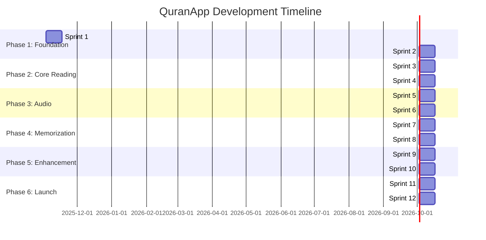
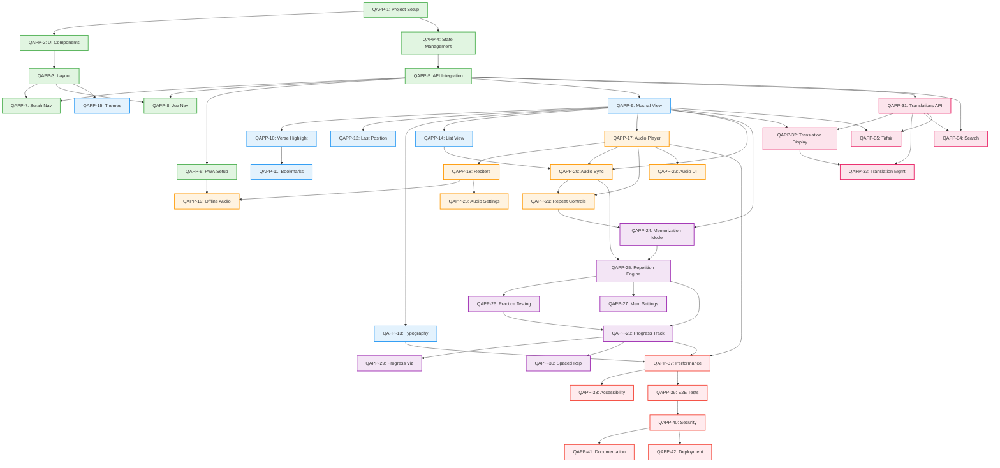
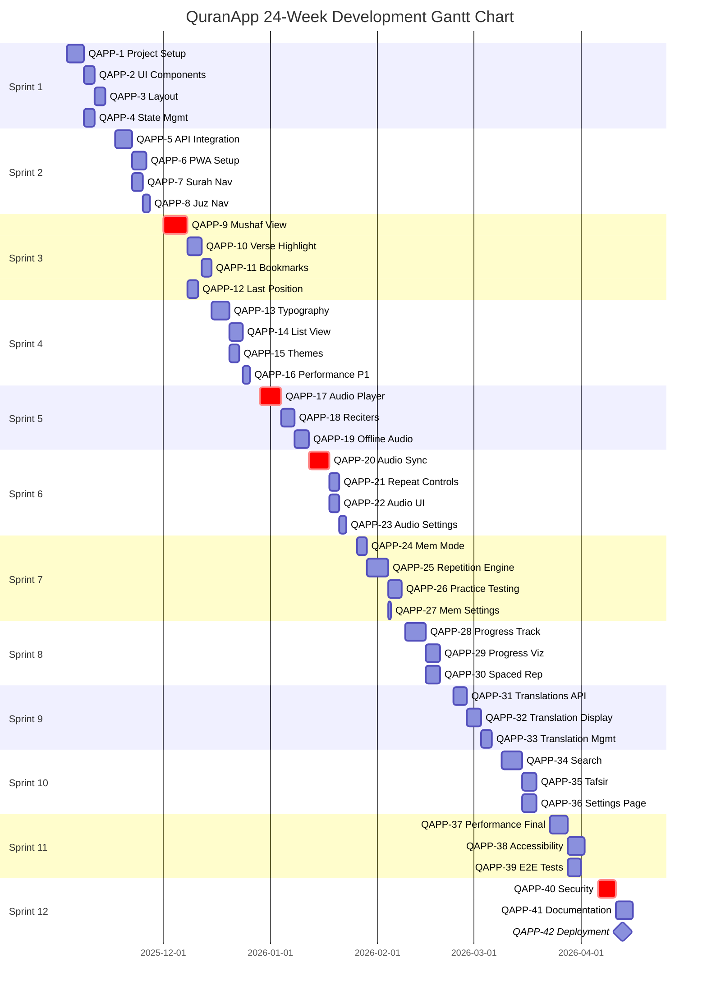

# QuranApp - Sprint-Based Development Roadmap

## Document Information

| Field | Value |
|-------|-------|
| **Project** | QuranApp MVP Development |
| **Duration** | 24 weeks (6 months) |
| **Total Sprints** | 12 (2 weeks each) |
| **Target Launch** | End of Sprint 12 |
| **Last Updated** | November 2025 |
| **Status** | Active Planning |

---

## Executive Summary

This roadmap breaks down the 6 MVP phases (defined in MVP.md) into 12 detailed two-week sprints. Each sprint focuses on delivering incremental value while maintaining high quality standards. The roadmap follows Agile principles with clear dependencies, risk mitigation strategies, and measurable success criteria.

### Key Metrics
- **Total Story Points**: 310
- **Average Sprint Velocity**: ~26 points
- **Team Size**: 3-5 developers
- **Sprint Duration**: 2 weeks (80 hours per developer)

---

## Table of Contents

1. [Sprint Overview](#sprint-overview)
2. [Phase 1: Foundation (Sprints 1-2)](#phase-1-foundation-sprints-1-2)
3. [Phase 2: Core Reading (Sprints 3-4)](#phase-2-core-reading-sprints-3-4)
4. [Phase 3: Audio Integration (Sprints 5-6)](#phase-3-audio-integration-sprints-5-6)
5. [Phase 4: Memorization (Sprints 7-8)](#phase-4-memorization-sprints-7-8)
6. [Phase 5: Enhancement (Sprints 9-10)](#phase-5-enhancement-sprints-9-10)
7. [Phase 6: Polish & Launch (Sprints 11-12)](#phase-6-polish--launch-sprints-11-12)
8. [Dependency Graph](#dependency-graph)
9. [Gantt Chart](#gantt-chart)
10. [Milestone Definitions](#milestone-definitions)
11. [Risk Assessment](#risk-assessment)
12. [Quality Gates](#quality-gates)

---

## Sprint Overview

### Sprint Capacity Planning

| Sprint | Story Points | Focus Areas | Risk Level |
|--------|--------------|-------------|------------|
| Sprint 1 | 21 | Infrastructure, Project Setup | Low |
| Sprint 2 | 26 | Core Architecture, API Integration | Medium |
| Sprint 3 | 34 | Mushaf View, Page Layout | High |
| Sprint 4 | 26 | Typography, Verse Interactions | Medium |
| Sprint 5 | 29 | Audio Player, Reciter Management | High |
| Sprint 6 | 26 | Audio Synchronization | High |
| Sprint 7 | 29 | Memorization Engine | Medium |
| Sprint 8 | 26 | Progress Tracking, Analytics | Low |
| Sprint 9 | 21 | Translations Integration | Low |
| Sprint 10 | 29 | Search, Tafsir, Settings | Medium |
| Sprint 11 | 21 | Performance Optimization | Medium |
| Sprint 12 | 22 | Testing, Launch Prep | High |
| **Total** | **310** | | |

---

## Phase 1: Foundation (Sprints 1-2)

### Sprint 1: Foundation Setup (Week 1-2)

**Sprint Goal**: Establish solid technical foundation with project structure, tooling, and basic UI components.

**Story Points**: 21

#### User Stories

##### QAPP-1: Project Infrastructure Setup
**Priority**: P0 (MUST HAVE)
**Story Points**: 8
**Assignee**: Tech Lead

**Description**: Set up complete development environment with modern tooling and best practices.

**Acceptance Criteria**:
- ✅ React 18 + TypeScript 5 + Vite 5 configured
- ✅ ESLint + Prettier + TypeScript strict mode
- ✅ Tailwind CSS + shadcn/ui integrated
- ✅ Git repository with branch strategy (main, develop, feature/*)
- ✅ GitHub Actions CI/CD pipeline (lint, typecheck, build)
- ✅ Vitest configured for unit testing
- ✅ Playwright configured for E2E testing
- ✅ Husky pre-commit hooks (lint, typecheck)

**Tasks**:
1. Initialize Vite + React + TypeScript project (2h)
2. Configure ESLint + Prettier with strict rules (1h)
3. Set up Tailwind CSS with custom theme (2h)
4. Install and configure shadcn/ui components (2h)
5. Configure testing frameworks (Vitest + Playwright) (3h)
6. Set up GitHub Actions workflows (3h)
7. Configure Husky pre-commit hooks (1h)
8. Document setup in README.md (2h)

**Dependencies**: None
**Blockers**: None

---

##### QAPP-2: Core UI Components Library
**Priority**: P0 (MUST HAVE)
**Story Points**: 5
**Assignee**: Frontend Developer 1

**Description**: Build reusable component library with shadcn/ui and custom Islamic design elements.

**Acceptance Criteria**:
- ✅ Button component with variants (primary, secondary, ghost)
- ✅ Card component for content containers
- ✅ Dialog/Modal component for overlays
- ✅ Loading skeleton components
- ✅ Toast notification system
- ✅ Icon library integrated (Lucide icons)
- ✅ Components fully typed with TypeScript
- ✅ Unit tests for all components (>80% coverage)

**Tasks**:
1. Create Button component with variants (3h)
2. Create Card component with Islamic patterns (4h)
3. Create Dialog/Modal component (4h)
4. Create Loading skeleton components (2h)
5. Set up Toast notification system (3h)
6. Integrate icon library (1h)
7. Write unit tests for components (5h)
8. Document components in Storybook (optional) (3h)

**Dependencies**: QAPP-1
**Blockers**: None

---

##### QAPP-3: Application Layout Structure
**Priority**: P0 (MUST HAVE)
**Story Points**: 5
**Assignee**: Frontend Developer 2

**Description**: Implement responsive application layout with header, main content area, and footer placeholders.

**Acceptance Criteria**:
- ✅ Responsive header with logo and navigation
- ✅ Main content area with proper scrolling
- ✅ Footer/bottom bar for future audio player
- ✅ Mobile-first responsive design (320px+)
- ✅ Dark mode and light mode support
- ✅ RTL (right-to-left) layout support
- ✅ Accessible keyboard navigation

**Tasks**:
1. Create Header component with responsive design (4h)
2. Create MainContent layout container (2h)
3. Create Footer component placeholder (2h)
4. Implement dark/light mode toggle (4h)
5. Implement RTL layout support (6h)
6. Add keyboard navigation (3h)
7. Responsive testing (320px - 2560px) (3h)

**Dependencies**: QAPP-2
**Blockers**: None

---

##### QAPP-4: State Management Setup
**Priority**: P0 (MUST HAVE)
**Story Points**: 3
**Assignee**: Tech Lead

**Description**: Configure Zustand for global state management with proper TypeScript typing.

**Acceptance Criteria**:
- ✅ Zustand stores created (quran, audio, settings, offline)
- ✅ TypeScript interfaces for all stores
- ✅ Persist middleware for localStorage
- ✅ DevTools middleware for debugging
- ✅ Store actions well-typed and documented
- ✅ Unit tests for store logic

**Tasks**:
1. Install and configure Zustand (1h)
2. Create store structure and interfaces (3h)
3. Implement persist middleware (2h)
4. Add DevTools middleware (1h)
5. Write store documentation (2h)
6. Create unit tests for stores (3h)

**Dependencies**: QAPP-1
**Blockers**: None

---

#### Sprint 1 Summary

**Total Story Points**: 21
**Total Tasks**: 35
**Estimated Hours**: 80 (2 weeks for 1 developer)

**Key Deliverables**:
- ✅ Fully configured development environment
- ✅ Reusable UI component library
- ✅ Responsive application layout
- ✅ State management foundation

**Definition of Done**:
- All code reviewed and merged to develop branch
- >80% unit test coverage
- All linting and type checking passing
- Documentation complete
- Demo-able to stakeholders

---

### Sprint 2: Core Architecture (Week 3-4)

**Sprint Goal**: Integrate Quran text API, implement basic navigation, and establish offline-first architecture.

**Story Points**: 26

#### User Stories

##### QAPP-5: Quran Text API Integration
**Priority**: P0 (MUST HAVE)
**Story Points**: 8
**Assignee**: Backend/API Developer

**Description**: Integrate Tanzil.net API for Quran text retrieval with proper error handling and caching.

**Acceptance Criteria**:
- ✅ API service layer created with Axios
- ✅ Fetch complete Quran text (6236 verses)
- ✅ Parse and store in IndexedDB for offline access
- ✅ Error handling and retry logic (max 3 attempts)
- ✅ Loading states and error messages
- ✅ Verify text accuracy against Mushaf Madinah
- ✅ TypeScript types for Verse and Surah entities

**Tasks**:
1. Create API service layer with Axios (3h)
2. Implement Tanzil.net API endpoints (4h)
3. Create Verse and Surah TypeScript interfaces (2h)
4. Set up IndexedDB schema for Quran text (4h)
5. Implement data parsing and storage (5h)
6. Add error handling and retry logic (3h)
7. Create loading and error UI states (3h)
8. Write integration tests (6h)
9. Verify text accuracy with scholars (10h)

**Dependencies**: QAPP-1, QAPP-4
**Blockers**: API rate limits (Tanzil.net)

---

##### QAPP-6: Service Worker & PWA Setup
**Priority**: P0 (MUST HAVE)
**Story Points**: 8
**Assignee**: Tech Lead

**Description**: Configure Workbox service worker for offline-first PWA functionality.

**Acceptance Criteria**:
- ✅ Workbox configured with Vite PWA plugin
- ✅ Service worker registers successfully
- ✅ Cache-first strategy for Quran text
- ✅ Network-first for API calls with fallback
- ✅ Background sync for data updates
- ✅ Install prompt for mobile devices
- ✅ Works offline after initial load
- ✅ Update notification when new version available

**Tasks**:
1. Install Vite PWA plugin and Workbox (2h)
2. Configure service worker strategies (5h)
3. Implement cache-first for static assets (3h)
4. Implement network-first with cache fallback (4h)
5. Add background sync functionality (4h)
6. Create install prompt UI (3h)
7. Implement update notification system (4h)
8. Test offline functionality (5h)

**Dependencies**: QAPP-1, QAPP-5
**Blockers**: Browser compatibility issues (older iOS Safari)

---

##### QAPP-7: Surah Navigation Component
**Priority**: P0 (MUST HAVE)
**Story Points**: 5
**Assignee**: Frontend Developer 1

**Description**: Build Surah index with search and quick navigation to any chapter.

**Acceptance Criteria**:
- ✅ List all 114 Surahs with Arabic names
- ✅ Display transliteration and English translation
- ✅ Show verse count and revelation location
- ✅ Search functionality (Arabic and transliteration)
- ✅ Click to navigate to Surah
- ✅ Highlight current Surah
- ✅ Responsive design (mobile and desktop)
- ✅ Keyboard navigation support

**Tasks**:
1. Design Surah list component UI (3h)
2. Fetch Surah metadata from API (2h)
3. Implement search functionality (4h)
4. Add click navigation to Surah (2h)
5. Implement current Surah highlighting (2h)
6. Make responsive (mobile-first) (3h)
7. Add keyboard navigation (3h)
8. Write component tests (3h)

**Dependencies**: QAPP-2, QAPP-5
**Blockers**: None

---

##### QAPP-8: Juz' & Page Navigation
**Priority**: P0 (MUST HAVE)
**Story Points**: 5
**Assignee**: Frontend Developer 2

**Description**: Implement navigation by Juz' (30 parts) and direct page number input (1-604).

**Acceptance Criteria**:
- ✅ Juz' navigator with 30 parts
- ✅ Show starting Surah:Verse for each Juz'
- ✅ Page number input (1-604) with validation
- ✅ Page slider for visual navigation
- ✅ Display current page/Juz' indicator
- ✅ Smooth navigation transitions
- ✅ Persist last position in localStorage

**Tasks**:
1. Create Juz' navigator component (4h)
2. Fetch Juz' metadata (starting points) (2h)
3. Implement page number input with validation (3h)
4. Create page slider component (4h)
5. Add current position indicator (2h)
6. Implement navigation transitions (3h)
7. Add localStorage persistence (3h)
8. Write navigation tests (3h)

**Dependencies**: QAPP-2, QAPP-5
**Blockers**: None

---

#### Sprint 2 Summary

**Total Story Points**: 26
**Total Tasks**: 32
**Estimated Hours**: 104 (2 weeks for 1.3 developers)

**Key Deliverables**:
- ✅ Quran text API fully integrated
- ✅ Offline-first PWA functionality
- ✅ Complete navigation system (Surah, Juz', Page)
- ✅ Data persistence in IndexedDB

**Definition of Done**:
- All navigation methods functional
- Quran text loads offline after first visit
- Service worker registers and caches correctly
- All tests passing (unit + integration)
- Code reviewed and merged

---

## Phase 2: Core Reading (Sprints 3-4)

### Sprint 3: Mushaf View Implementation (Week 5-6)

**Sprint Goal**: Build authentic Mushaf page view with proper Arabic rendering and page boundaries.

**Story Points**: 34

#### User Stories

##### QAPP-9: Mushaf Page View Component
**Priority**: P0 (MUST HAVE)
**Story Points**: 13
**Assignee**: Frontend Developer 1 + Islamic Typography Expert

**Description**: Implement authentic Mushaf page layout matching Madani Mushaf exactly.

**Acceptance Criteria**:
- ✅ Display exactly 604 pages (Madani Mushaf standard)
- ✅ Each page matches physical Mushaf boundaries
- ✅ Proper Uthmani script rendering (Hafs 'an 'Asim)
- ✅ Correct line breaks and verse positioning
- ✅ Tajweed marks render properly
- ✅ Page numbers visible (top or bottom)
- ✅ Zoom and pan gestures (pinch-to-zoom)
- ✅ Smooth page turn animations
- ✅ Verified by Islamic scholars

**Tasks**:
1. Research Mushaf layout specifications (8h)
2. Design page component with proper dimensions (6h)
3. Implement Uthmani script with Amiri Quran font (8h)
4. Ensure correct line breaks per page (10h)
5. Add Tajweed marks rendering (8h)
6. Implement page number display (2h)
7. Add zoom and pan gestures (8h)
8. Create page turn animations (6h)
9. Islamic scholar verification (16h)
10. Write comprehensive tests (10h)

**Dependencies**: QAPP-5 (Quran text API)
**Blockers**: **HIGH RISK** - Arabic typography complexity, scholar availability

---

##### QAPP-10: Verse Highlighting & Selection
**Priority**: P0 (MUST HAVE)
**Story Points**: 8
**Assignee**: Frontend Developer 2

**Description**: Enable verse highlighting on tap/click with context menu for actions.

**Acceptance Criteria**:
- ✅ Single tap highlights verse
- ✅ Highlighted verse visually distinct (background color)
- ✅ Only one verse highlighted at a time
- ✅ Double tap opens verse action menu
- ✅ Context menu: Copy, Share, Tafsir, Bookmark
- ✅ Tap outside verse to deselect
- ✅ Keyboard navigation (arrow keys)
- ✅ Accessibility: screen reader announces verse

**Tasks**:
1. Implement verse click/tap detection (4h)
2. Add highlight styling (2h)
3. Ensure single verse highlight logic (2h)
4. Create context menu component (6h)
5. Implement Copy verse functionality (3h)
6. Implement Share functionality (4h)
7. Add Tafsir and Bookmark placeholders (2h)
8. Add keyboard navigation (4h)
9. Implement screen reader support (5h)
10. Write interaction tests (6h)

**Dependencies**: QAPP-9
**Blockers**: None

---

##### QAPP-11: Bookmark System
**Priority**: P1 (SHOULD HAVE)
**Story Points**: 8
**Assignee**: Frontend Developer 1

**Description**: Allow users to save unlimited bookmarks with custom labels.

**Acceptance Criteria**:
- ✅ Add bookmark for current verse/page
- ✅ Custom bookmark labels/names
- ✅ Organize bookmarks by categories (optional)
- ✅ Quick access bookmark dropdown
- ✅ Delete and edit bookmarks
- ✅ Persist bookmarks in localStorage
- ✅ Sync bookmarks across devices (future: cloud sync)
- ✅ Export/import bookmarks (JSON format)

**Tasks**:
1. Design bookmark data structure (2h)
2. Create bookmark manager component (5h)
3. Implement add bookmark UI (3h)
4. Add custom label input (2h)
5. Create bookmark list with search (5h)
6. Implement delete and edit (4h)
7. Add localStorage persistence (3h)
8. Implement export/import (5h)
9. Write bookmark tests (6h)

**Dependencies**: QAPP-10
**Blockers**: None

---

##### QAPP-12: Last Read Position Persistence
**Priority**: P0 (MUST HAVE)
**Story Points**: 5
**Assignee**: Frontend Developer 2

**Description**: Auto-save and restore user's last reading position.

**Acceptance Criteria**:
- ✅ Auto-save current position on page change
- ✅ Save position on app close (beforeunload)
- ✅ Restore position on app open
- ✅ Display "Continue Reading" prompt
- ✅ Store Surah, Verse, and Page number
- ✅ Persist in localStorage
- ✅ Handle edge cases (deleted bookmarks, etc.)

**Tasks**:
1. Design position data structure (1h)
2. Implement auto-save on page change (3h)
3. Add beforeunload event handler (2h)
4. Create position restore logic (3h)
5. Design "Continue Reading" UI prompt (3h)
6. Add localStorage persistence (2h)
7. Handle edge cases (corrupt data, etc.) (4h)
8. Write persistence tests (4h)

**Dependencies**: QAPP-9
**Blockers**: None

---

#### Sprint 3 Summary

**Total Story Points**: 34
**Total Tasks**: 37
**Estimated Hours**: 136 (2 weeks for 1.7 developers)

**Key Deliverables**:
- ✅ Authentic Mushaf page view
- ✅ Verse highlighting and interaction
- ✅ Bookmark system
- ✅ Last read position persistence

**Definition of Done**:
- Mushaf pages match physical Mushaf exactly
- Islamic scholar verification complete
- All user interactions functional
- Accessibility compliance (WCAG 2.1 AA)
- Tests passing (unit + E2E)

**Critical Success Factors**:
- **Arabic Typography**: Collaborate closely with Islamic typography expert
- **Scholar Verification**: Schedule early to avoid delays
- **Performance**: Ensure smooth 60fps scrolling and rendering

---

### Sprint 4: Typography Optimization & UX Polish (Week 7-8)

**Sprint Goal**: Perfect Arabic typography, optimize performance, and enhance user experience.

**Story Points**: 26

#### User Stories

##### QAPP-13: Arabic Typography Excellence
**Priority**: P0 (MUST HAVE)
**Story Points**: 8
**Assignee**: Frontend Developer 1 + Typography Expert

**Description**: Achieve professional-grade Arabic rendering with optimal readability.

**Acceptance Criteria**:
- ✅ Proper Tajweed marks (Fatha, Kasra, Damma, Sukun, etc.)
- ✅ Correct ligature support for connected letters
- ✅ Optimal line height (1.8-2.0) and letter spacing
- ✅ Font size adjustable (16px-32px)
- ✅ Support Amiri Quran and KFGQPC fonts
- ✅ RTL text flow with no rendering glitches
- ✅ Color-coded Tajweed (optional toggle)
- ✅ High-DPI/Retina display optimization

**Tasks**:
1. Fine-tune Tajweed mark positioning (8h)
2. Implement ligature support (6h)
3. Optimize line height and spacing (4h)
4. Add font size control (3h)
5. Integrate multiple Arabic fonts (5h)
6. Ensure perfect RTL rendering (6h)
7. Add color-coded Tajweed mode (8h)
8. Optimize for Retina displays (4h)
9. Cross-browser testing (6h)
10. Performance profiling (4h)

**Dependencies**: QAPP-9
**Blockers**: Font licensing, browser rendering differences

---

##### QAPP-14: List View Mode
**Priority**: P1 (SHOULD HAVE)
**Story Points**: 8
**Assignee**: Frontend Developer 2

**Description**: Implement continuous scrolling list view as alternative to Mushaf pages.

**Acceptance Criteria**:
- ✅ Verse-by-verse list with infinite scroll
- ✅ Surah headers with metadata (name, verses, location)
- ✅ Each verse clearly separated
- ✅ Verse numbers displayed
- ✅ Toggle between Mushaf and List views
- ✅ Smooth scrolling (60fps)
- ✅ Virtual scrolling for performance
- ✅ Maintain last position when switching views

**Tasks**:
1. Design list view component (4h)
2. Implement verse list rendering (6h)
3. Add Surah headers (3h)
4. Implement infinite/virtual scroll (8h)
5. Create view toggle UI (3h)
6. Ensure smooth 60fps scrolling (6h)
7. Add position persistence across views (4h)
8. Write list view tests (6h)

**Dependencies**: QAPP-9, QAPP-12
**Blockers**: None

---

##### QAPP-15: Theme System (Dark/Light/Sepia)
**Priority**: P1 (SHOULD HAVE)
**Story Points**: 5
**Assignee**: Frontend Developer 1

**Description**: Implement comprehensive theming with dark, light, and sepia modes.

**Acceptance Criteria**:
- ✅ Light mode (default)
- ✅ Dark mode
- ✅ Sepia mode (for reading comfort)
- ✅ Auto mode (follows system preference)
- ✅ Theme persists across sessions
- ✅ Smooth theme transitions (200ms)
- ✅ All components themed consistently
- ✅ Color contrast meets WCAG AA (4.5:1)

**Tasks**:
1. Define color palettes for all themes (4h)
2. Implement CSS variables for theming (3h)
3. Create theme toggle component (3h)
4. Add system preference detection (2h)
5. Implement theme persistence (2h)
6. Add smooth transitions (2h)
7. Verify color contrast (WCAG) (4h)
8. Test all components in each theme (6h)

**Dependencies**: QAPP-3 (Layout)
**Blockers**: None

---

##### QAPP-16: Performance Optimization (Phase 1)
**Priority**: P0 (MUST HAVE)
**Story Points**: 5
**Assignee**: Tech Lead

**Description**: Optimize initial load time and runtime performance.

**Acceptance Criteria**:
- ✅ Initial load < 3 seconds (3G network)
- ✅ Time to Interactive (TTI) < 3 seconds
- ✅ First Contentful Paint (FCP) < 1.5 seconds
- ✅ Smooth scrolling (60fps)
- ✅ Bundle size < 500KB (gzipped)
- ✅ Code splitting by route
- ✅ Lazy loading for components
- ✅ Image optimization (WebP format)

**Tasks**:
1. Implement code splitting (4h)
2. Add lazy loading for routes (3h)
3. Optimize bundle size (analyze + trim) (6h)
4. Implement image optimization (3h)
5. Add performance monitoring (4h)
6. Run Lighthouse audits (2h)
7. Fix performance bottlenecks (8h)
8. Document optimization strategies (2h)

**Dependencies**: All previous stories
**Blockers**: None

---

#### Sprint 4 Summary

**Total Story Points**: 26
**Total Tasks**: 38
**Estimated Hours**: 104 (2 weeks for 1.3 developers)

**Key Deliverables**:
- ✅ Professional Arabic typography
- ✅ List view mode (alternative to Mushaf)
- ✅ Complete theme system (dark/light/sepia)
- ✅ Performance optimization (initial phase)

**Definition of Done**:
- Typography verified by Islamic scholars
- Lighthouse score > 85 (all categories)
- All themes accessible (WCAG AA)
- Smooth 60fps interactions
- Code reviewed and tested

---

## Phase 3: Audio Integration (Sprints 5-6)

### Sprint 5: Audio Player & Reciter Management (Week 9-10)

**Sprint Goal**: Build robust audio player with multiple reciter support and offline caching.

**Story Points**: 29

#### User Stories

##### QAPP-17: Audio Player Component
**Priority**: P0 (MUST HAVE)
**Story Points**: 13
**Assignee**: Frontend Developer 1 + Audio Engineer

**Description**: Implement professional audio player with all essential controls.

**Acceptance Criteria**:
- ✅ Play/pause button
- ✅ Skip to next/previous verse
- ✅ Progress bar with seek functionality
- ✅ Volume control slider
- ✅ Playback speed (0.5x, 0.75x, 1.0x, 1.25x, 1.5x, 2.0x)
- ✅ Repeat modes (single verse, range, Surah, all)
- ✅ Background playback (mobile)
- ✅ Lock screen media controls (iOS/Android)
- ✅ Keyboard shortcuts (space, arrows)
- ✅ Accessible (screen reader support)

**Tasks**:
1. Research HTML5 Audio API (4h)
2. Design audio player UI (6h)
3. Implement play/pause logic (4h)
4. Add skip next/previous (3h)
5. Create progress bar with seek (6h)
6. Add volume control (3h)
7. Implement playback speed control (4h)
8. Add repeat modes (6h)
9. Implement background playback (8h)
10. Add lock screen controls (6h)
11. Add keyboard shortcuts (4h)
12. Implement screen reader support (6h)
13. Write audio player tests (10h)

**Dependencies**: QAPP-9 (Mushaf view)
**Blockers**: **MEDIUM RISK** - Browser audio API limitations, mobile background playback permissions

---

##### QAPP-18: Reciter Selection & Management
**Priority**: P0 (MUST HAVE)
**Story Points**: 8
**Assignee**: Backend/API Developer

**Description**: Integrate multiple renowned Qaris with metadata and audio source management.

**Acceptance Criteria**:
- ✅ Minimum 5 reciters available (Mishary, Abdul Basit, Saad, etc.)
- ✅ Reciter profiles (name, style, bio)
- ✅ Audio quality: 128kbps minimum, 192kbps preferred
- ✅ Verse-by-verse audio segments
- ✅ Continuous playback across Surahs
- ✅ Reciter selection UI (dropdown or modal)
- ✅ Default reciter preference saved
- ✅ Audio source from Quranicaudio.com

**Tasks**:
1. Research Quranicaudio.com API (4h)
2. Create reciter data model (2h)
3. Fetch reciter metadata (3h)
4. Implement audio source URLs (4h)
5. Design reciter selection UI (4h)
6. Add reciter profiles (3h)
7. Implement default reciter logic (2h)
8. Add reciter preference persistence (3h)
9. Write reciter tests (5h)

**Dependencies**: QAPP-17
**Blockers**: API availability, audio source reliability

---

##### QAPP-19: Offline Audio Download
**Priority**: P0 (MUST HAVE)
**Story Points**: 8
**Assignee**: Tech Lead

**Description**: Enable users to download audio for offline listening.

**Acceptance Criteria**:
- ✅ Download entire Surah audio
- ✅ Download by Juz' or custom verse range
- ✅ Download queue with progress indicator
- ✅ Background download support
- ✅ Pause/resume downloads
- ✅ Storage management UI (view size, delete)
- ✅ Download only on WiFi (optional setting)
- ✅ Estimate storage before download

**Tasks**:
1. Design download system architecture (4h)
2. Implement download queue (6h)
3. Add progress indicators (4h)
4. Implement background downloads (8h)
5. Add pause/resume functionality (4h)
6. Create storage management UI (6h)
7. Add WiFi-only setting (3h)
8. Implement storage estimation (3h)
9. Write download tests (8h)

**Dependencies**: QAPP-18, QAPP-6 (Service Worker)
**Blockers**: **MEDIUM RISK** - Large file downloads, storage quota limits

---

#### Sprint 5 Summary

**Total Story Points**: 29
**Total Tasks**: 31
**Estimated Hours**: 116 (2 weeks for 1.45 developers)

**Key Deliverables**:
- ✅ Fully functional audio player
- ✅ Multiple reciter support
- ✅ Offline audio download system

**Definition of Done**:
- Audio player works on all major browsers
- Background playback functional on mobile
- At least 5 reciters available
- Offline audio downloads working
- All tests passing

---

### Sprint 6: Audio Synchronization (Week 11-12)

**Sprint Goal**: Implement real-time verse highlighting synchronized with audio playback.

**Story Points**: 26

#### User Stories

##### QAPP-20: Audio-Verse Synchronization
**Priority**: P0 (MUST HAVE)
**Story Points**: 13
**Assignee**: Frontend Developer 1 + Audio Engineer

**Description**: Synchronize audio playback with verse highlighting in real-time.

**Acceptance Criteria**:
- ✅ Current verse highlights as audio plays
- ✅ Synchronization accuracy < 100ms
- ✅ Auto-scroll to follow highlighted verse
- ✅ Manual scroll temporarily pauses auto-scroll
- ✅ Resume auto-scroll when scroll stops
- ✅ Works in both Mushaf and List views
- ✅ Handles verse timing variations (short/long verses)
- ✅ No lag or jitter in highlighting

**Tasks**:
1. Research audio timing synchronization (6h)
2. Create verse timing metadata (8h)
3. Implement real-time highlight logic (10h)
4. Add auto-scroll functionality (8h)
5. Detect manual scroll and pause auto-scroll (6h)
6. Resume auto-scroll logic (4h)
7. Test synchronization accuracy (8h)
8. Optimize for no lag (60fps) (10h)
9. Cross-browser testing (6h)
10. Write synchronization tests (10h)

**Dependencies**: QAPP-17, QAPP-9, QAPP-14
**Blockers**: **HIGH RISK** - Timing accuracy, performance on low-end devices

---

##### QAPP-21: Repeat & Loop Controls
**Priority**: P0 (MUST HAVE)
**Story Points**: 5
**Assignee**: Frontend Developer 2

**Description**: Implement advanced repeat modes for memorization practice.

**Acceptance Criteria**:
- ✅ Repeat single verse (1x-10x, custom)
- ✅ Repeat verse range (user-selected)
- ✅ Repeat entire Surah
- ✅ Repeat all (continuous playback)
- ✅ Visual indicator for repeat mode
- ✅ Repeat count display (e.g., "3/5")
- ✅ Pause between repetitions (0-5 seconds, configurable)
- ✅ Save repeat preferences

**Tasks**:
1. Design repeat mode UI (3h)
2. Implement single verse repeat (4h)
3. Add verse range repeat (5h)
4. Implement Surah repeat (3h)
5. Add continuous repeat all (2h)
6. Create repeat count display (2h)
7. Add pause between repetitions (4h)
8. Persist repeat preferences (2h)
9. Write repeat mode tests (5h)

**Dependencies**: QAPP-17, QAPP-20
**Blockers**: None

---

##### QAPP-22: Audio Player UI Polish
**Priority**: P1 (SHOULD HAVE)
**Story Points**: 5
**Assignee**: Frontend Developer 1

**Description**: Enhance audio player UI/UX with animations and accessibility.

**Acceptance Criteria**:
- ✅ Smooth expand/collapse animations
- ✅ Mini player mode (collapsed)
- ✅ Full player mode (expanded)
- ✅ Draggable player (optional)
- ✅ Visual feedback for all interactions
- ✅ Accessible to keyboard and screen readers
- ✅ Responsive design (mobile/tablet/desktop)
- ✅ Beautiful waveform visualization (optional)

**Tasks**:
1. Design mini and full player modes (4h)
2. Implement expand/collapse animations (4h)
3. Add draggable player (optional) (6h)
4. Improve visual feedback (3h)
5. Enhance keyboard accessibility (4h)
6. Improve screen reader support (4h)
7. Make fully responsive (4h)
8. Add waveform visualization (optional) (8h)

**Dependencies**: QAPP-17
**Blockers**: None

---

##### QAPP-23: Audio Settings & Preferences
**Priority**: P1 (SHOULD HAVE)
**Story Points**: 3
**Assignee**: Frontend Developer 2

**Description**: Allow users to customize audio playback preferences.

**Acceptance Criteria**:
- ✅ Default reciter selection
- ✅ Default playback speed
- ✅ Auto-play next verse/Surah
- ✅ Background playback toggle
- ✅ WiFi-only downloads toggle
- ✅ Audio quality preference (if multiple available)
- ✅ Persist all settings in localStorage

**Tasks**:
1. Create audio settings UI (3h)
2. Add default reciter setting (2h)
3. Add playback speed default (2h)
4. Add auto-play toggle (2h)
5. Add background playback toggle (2h)
6. Add WiFi-only downloads toggle (2h)
7. Persist settings in localStorage (2h)
8. Write settings tests (3h)

**Dependencies**: QAPP-18, QAPP-17
**Blockers**: None

---

#### Sprint 6 Summary

**Total Story Points**: 26
**Total Tasks**: 30
**Estimated Hours**: 104 (2 weeks for 1.3 developers)

**Key Deliverables**:
- ✅ Real-time audio-verse synchronization
- ✅ Advanced repeat and loop controls
- ✅ Polished audio player UI
- ✅ Audio settings and preferences

**Definition of Done**:
- Synchronization accuracy < 100ms
- All repeat modes functional
- Audio player accessible (WCAG AA)
- Settings persist across sessions
- All tests passing (unit + E2E)

**Critical Success Factors**:
- **Timing Accuracy**: Collaborate with audio engineer for precise timing
- **Performance**: Test on low-end devices to ensure smooth playback
- **User Testing**: Gather feedback on repeat modes usability

---

## Phase 4: Memorization (Sprints 7-8)

### Sprint 7: Repetition Engine (Week 13-14)

**Sprint Goal**: Build memorization engine with repetition controls and practice modes.

**Story Points**: 29

#### User Stories

##### QAPP-24: Memorization Mode Toggle
**Priority**: P0 (MUST HAVE)
**Story Points**: 5
**Assignee**: Frontend Developer 1

**Description**: Enable users to activate memorization mode with special UI and controls.

**Acceptance Criteria**:
- ✅ Toggle memorization mode on/off
- ✅ Visual indicator when mode is active
- ✅ Memorization controls overlay (repeat count, range)
- ✅ Select verse range for memorization
- ✅ Display current repetition count (e.g., "3/5")
- ✅ Persist memorization mode state
- ✅ Distinct UI from reading mode

**Tasks**:
1. Design memorization mode UI (4h)
2. Create mode toggle component (3h)
3. Implement mode state management (3h)
4. Add visual indicators (2h)
5. Create controls overlay (4h)
6. Add verse range selection UI (5h)
7. Display repetition counter (2h)
8. Persist mode state (2h)
9. Write memorization mode tests (5h)

**Dependencies**: QAPP-9, QAPP-21
**Blockers**: None

---

##### QAPP-25: Repetition Control System
**Priority**: P0 (MUST HAVE)
**Story Points**: 13
**Assignee**: Frontend Developer 2 + Backend Developer

**Description**: Implement intelligent repetition system for memorization practice.

**Acceptance Criteria**:
- ✅ Repetition counts: 1x, 3x, 5x, 7x, 10x, custom
- ✅ Auto-advance to next verse after repetitions
- ✅ Configurable delay between repetitions (0-10 seconds)
- ✅ Pause between verses (0-5 seconds)
- ✅ Play entire range, then repeat
- ✅ Visual progress bar for repetitions
- ✅ Skip to next verse manually
- ✅ Reset repetition counter

**Tasks**:
1. Design repetition algorithm (6h)
2. Implement repetition counter logic (8h)
3. Add auto-advance functionality (6h)
4. Implement configurable delays (4h)
5. Add pause between verses (3h)
6. Create range repetition logic (6h)
7. Design progress bar UI (3h)
8. Add skip functionality (2h)
9. Add reset counter (2h)
10. Write repetition tests (10h)

**Dependencies**: QAPP-24, QAPP-20
**Blockers**: None

---

##### QAPP-26: Practice Testing Modes
**Priority**: P1 (SHOULD HAVE)
**Story Points**: 8
**Assignee**: Frontend Developer 1

**Description**: Implement testing modes to verify memorization without seeing text.

**Acceptance Criteria**:
- ✅ Hide text mode (audio only, no Arabic text)
- ✅ Show first word mode (prompt with first word)
- ✅ Reveal verse after user attempt
- ✅ "I Know It" / "Review Again" buttons
- ✅ Random verse quiz mode
- ✅ Score tracking for tests (correct/incorrect)
- ✅ Review mistakes at end of session

**Tasks**:
1. Design testing mode UI (5h)
2. Implement hide text mode (4h)
3. Add first word prompt mode (4h)
4. Create reveal verse UI (3h)
5. Add "Know It"/"Review" buttons (3h)
6. Implement random quiz logic (6h)
7. Add score tracking (5h)
8. Create review mistakes screen (6h)
9. Write testing mode tests (8h)

**Dependencies**: QAPP-24, QAPP-25
**Blockers**: None

---

##### QAPP-27: Memorization Settings
**Priority**: P1 (SHOULD HAVE)
**Story Points**: 3
**Assignee**: Frontend Developer 2

**Description**: Allow users to customize memorization preferences.

**Acceptance Criteria**:
- ✅ Daily memorization goal (verses per day)
- ✅ Default repetition count
- ✅ Auto-advance delay default
- ✅ Pause between verses default
- ✅ Enable/disable practice testing
- ✅ Reminder notification time
- ✅ Persist all settings

**Tasks**:
1. Create memorization settings UI (4h)
2. Add daily goal setting (2h)
3. Add default repetition count (2h)
4. Add delay settings (2h)
5. Add practice testing toggle (2h)
6. Add reminder time setting (3h)
7. Persist settings in localStorage (2h)
8. Write settings tests (3h)

**Dependencies**: QAPP-25
**Blockers**: None

---

#### Sprint 7 Summary

**Total Story Points**: 29
**Total Tasks**: 36
**Estimated Hours**: 116 (2 weeks for 1.45 developers)

**Key Deliverables**:
- ✅ Memorization mode with controls
- ✅ Intelligent repetition system
- ✅ Practice testing modes
- ✅ Memorization preferences

**Definition of Done**:
- All repetition modes functional
- Testing modes work correctly
- Settings persist across sessions
- User testing completed
- All tests passing

---

### Sprint 8: Progress Tracking & Analytics (Week 15-16)

**Sprint Goal**: Implement progress tracking, statistics, and spaced repetition algorithm.

**Story Points**: 26

#### User Stories

##### QAPP-28: Memorization Progress Tracking
**Priority**: P0 (MUST HAVE)
**Story Points**: 13
**Assignee**: Backend Developer + Data Analyst

**Description**: Track user's memorization progress with detailed statistics.

**Acceptance Criteria**:
- ✅ Mark verses/Surahs as memorized
- ✅ Track repetitions per verse
- ✅ Record time spent memorizing
- ✅ Daily/weekly/monthly statistics
- ✅ Streak tracking (consecutive days)
- ✅ Last review date per verse
- ✅ Data stored in IndexedDB
- ✅ Export progress data (JSON)

**Tasks**:
1. Design progress data model (4h)
2. Implement verse tracking (6h)
3. Add repetition counter per verse (4h)
4. Track time spent memorizing (5h)
5. Calculate daily/weekly/monthly stats (6h)
6. Implement streak tracking (5h)
7. Store last review dates (3h)
8. Implement IndexedDB storage (6h)
9. Add export functionality (4h)
10. Write tracking tests (10h)

**Dependencies**: QAPP-25, QAPP-26
**Blockers**: None

---

##### QAPP-29: Progress Visualization
**Priority**: P0 (MUST HAVE)
**Story Points**: 8
**Assignee**: Frontend Developer 1

**Description**: Create visual dashboards for progress and statistics.

**Acceptance Criteria**:
- ✅ Progress bars per Surah
- ✅ Heatmap calendar for practice consistency
- ✅ Pie chart for overall completion (% of Quran)
- ✅ Line graph for weekly progress trend
- ✅ Statistics cards (verses memorized, streak, time)
- ✅ Filterable by date range
- ✅ Responsive design (mobile/desktop)
- ✅ Accessible visualizations

**Tasks**:
1. Research chart libraries (Recharts, Chart.js) (3h)
2. Design dashboard UI (5h)
3. Implement progress bars (4h)
4. Create heatmap calendar (6h)
5. Add pie chart for completion (4h)
6. Create line graph for trends (4h)
7. Design statistics cards (3h)
8. Add date range filters (4h)
9. Make responsive and accessible (6h)
10. Write visualization tests (5h)

**Dependencies**: QAPP-28
**Blockers**: None

---

##### QAPP-30: Spaced Repetition Algorithm
**Priority**: P1 (SHOULD HAVE)
**Story Points**: 5
**Assignee**: Backend Developer + Algorithm Specialist

**Description**: Implement SM-2 based spaced repetition for review scheduling.

**Acceptance Criteria**:
- ✅ SM-2 algorithm implementation
- ✅ New verses: review after 1 day
- ✅ Learning: review after 3, 7, 14 days
- ✅ Mastered: review after 30, 90 days
- ✅ Adjust intervals based on performance
- ✅ Notification for due reviews
- ✅ Customizable intervals (advanced settings)

**Tasks**:
1. Research SM-2 algorithm (4h)
2. Implement base SM-2 logic (8h)
3. Define review stages (new, learning, mastered) (3h)
4. Calculate next review dates (5h)
5. Adjust intervals based on performance (6h)
6. Implement review notification system (4h)
7. Add customizable intervals (3h)
8. Write algorithm tests (7h)

**Dependencies**: QAPP-28
**Blockers**: None

---

#### Sprint 8 Summary

**Total Story Points**: 26
**Total Tasks**: 28
**Estimated Hours**: 104 (2 weeks for 1.3 developers)

**Key Deliverables**:
- ✅ Comprehensive progress tracking
- ✅ Visual progress dashboards
- ✅ Spaced repetition algorithm

**Definition of Done**:
- Progress tracking accurate
- Visualizations clear and informative
- Spaced repetition algorithm functional
- All data persists correctly
- Tests passing

---

## Phase 5: Enhancement (Sprints 9-10)

### Sprint 9: Translations Integration (Week 17-18)

**Sprint Goal**: Integrate multiple language translations with side-by-side display.

**Story Points**: 21

#### User Stories

##### QAPP-31: Translation API Integration
**Priority**: P1 (SHOULD HAVE)
**Story Points**: 8
**Assignee**: Backend Developer

**Description**: Integrate translations from Quran.com API or similar sources.

**Acceptance Criteria**:
- ✅ Minimum 10 languages supported
- ✅ Multiple translators per language (3+ options)
- ✅ Respected translators (Sahih International, Muhammad Asad, etc.)
- ✅ Fetch translations from API
- ✅ Store translations in IndexedDB for offline
- ✅ Translation metadata (author, language, style)
- ✅ Verify translation accuracy

**Tasks**:
1. Research translation APIs (Quran.com, etc.) (4h)
2. Create translation data model (3h)
3. Implement API integration (6h)
4. Fetch and parse translations (5h)
5. Store in IndexedDB (4h)
6. Add translation metadata (3h)
7. Verify translation accuracy (8h)
8. Write translation tests (7h)

**Dependencies**: QAPP-5 (API integration)
**Blockers**: API availability, translation quality verification

---

##### QAPP-32: Translation Display Modes
**Priority**: P1 (SHOULD HAVE)
**Story Points**: 8
**Assignee**: Frontend Developer 1

**Description**: Implement multiple display modes for translations.

**Acceptance Criteria**:
- ✅ Arabic only mode
- ✅ Translation only mode
- ✅ Arabic + Translation (stacked)
- ✅ Arabic + Translation (side-by-side)
- ✅ Switch modes without losing position
- ✅ Font size control for translations
- ✅ Multiple translations displayed simultaneously (optional)
- ✅ Responsive design (all modes work on mobile)

**Tasks**:
1. Design display mode layouts (5h)
2. Implement Arabic only mode (2h)
3. Implement translation only mode (2h)
4. Create stacked layout (4h)
5. Create side-by-side layout (5h)
6. Add mode switching UI (3h)
7. Implement font size control (3h)
8. Add multiple translations view (6h)
9. Make all modes responsive (6h)
10. Write display mode tests (6h)

**Dependencies**: QAPP-31, QAPP-9
**Blockers**: None

---

##### QAPP-33: Translation Selection & Management
**Priority**: P1 (SHOULD HAVE)
**Story Points**: 5
**Assignee**: Frontend Developer 2

**Description**: Allow users to select and manage preferred translations.

**Acceptance Criteria**:
- ✅ Translation selection UI (dropdown or modal)
- ✅ Language filter (show only selected language)
- ✅ Default translation preference
- ✅ Multiple translations can be active
- ✅ Download translations for offline use
- ✅ Manage downloaded translations (view, delete)
- ✅ Translation credits (author, publisher)

**Tasks**:
1. Design translation selection UI (4h)
2. Implement language filter (3h)
3. Add default translation setting (2h)
4. Allow multiple active translations (4h)
5. Implement translation downloads (5h)
6. Create management UI (4h)
7. Display translation credits (2h)
8. Write selection tests (6h)

**Dependencies**: QAPP-31, QAPP-32
**Blockers**: None

---

#### Sprint 9 Summary

**Total Story Points**: 21
**Total Tasks**: 25
**Estimated Hours**: 84 (2 weeks for 1.05 developers)

**Key Deliverables**:
- ✅ Translation API integration
- ✅ Multiple display modes
- ✅ Translation selection and management

**Definition of Done**:
- At least 10 languages available
- All display modes functional
- Translations work offline
- Translation accuracy verified
- Tests passing

---

### Sprint 10: Search, Tafsir & Settings (Week 19-20)

**Sprint Goal**: Implement search functionality, Tafsir integration, and comprehensive settings.

**Story Points**: 29

#### User Stories

##### QAPP-34: Quran Search Functionality
**Priority**: P1 (SHOULD HAVE)
**Story Points**: 13
**Assignee**: Backend Developer + Frontend Developer 1

**Description**: Implement comprehensive search across Quran text and translations.

**Acceptance Criteria**:
- ✅ Full-text Arabic search (with/without diacritics)
- ✅ Translation search (all loaded languages)
- ✅ Root word search (Arabic morphology)
- ✅ Advanced filters (Surah, Juz', page range, Meccan/Medinan)
- ✅ Search results with context (surrounding verses)
- ✅ Highlight search terms in results
- ✅ Search history (last 10 searches)
- ✅ Saved searches / bookmarked searches
- ✅ Fast search (< 800ms)

**Tasks**:
1. Research search algorithms (Lunr.js, Fuse.js) (4h)
2. Implement Arabic search with diacritics (8h)
3. Add translation search (6h)
4. Implement root word search (10h)
5. Add advanced filters (6h)
6. Design search results UI (5h)
7. Implement result highlighting (4h)
8. Add search history (3h)
9. Implement saved searches (4h)
10. Optimize search performance (8h)
11. Write search tests (10h)

**Dependencies**: QAPP-5, QAPP-31
**Blockers**: **MEDIUM RISK** - Arabic morphology complexity, search performance

---

##### QAPP-35: Tafsir Integration
**Priority**: P1 (SHOULD HAVE)
**Story Points**: 8
**Assignee**: Backend Developer

**Description**: Integrate classical and modern Tafsir (Quranic explanations).

**Acceptance Criteria**:
- ✅ Classical Tafsir: Ibn Kathir, Al-Tabari
- ✅ Modern commentaries: Ma'ariful Quran, Tafhim-ul-Quran
- ✅ Multiple languages (English and Arabic minimum)
- ✅ Verse-by-verse explanations
- ✅ Tap verse to open Tafsir popup/modal
- ✅ Scholar citations and references
- ✅ Bookmark Tafsir sections
- ✅ Offline Tafsir storage

**Tasks**:
1. Research Tafsir data sources (6h)
2. Create Tafsir data model (3h)
3. Integrate Tafsir API/sources (8h)
4. Implement verse-to-Tafsir mapping (5h)
5. Design Tafsir modal UI (5h)
6. Add scholar citations (3h)
7. Implement Tafsir bookmarks (4h)
8. Store Tafsir offline (IndexedDB) (6h)
9. Write Tafsir tests (8h)

**Dependencies**: QAPP-9, QAPP-31
**Blockers**: Tafsir source availability, scholarly review

---

##### QAPP-36: Comprehensive Settings Page
**Priority**: P1 (SHOULD HAVE)
**Story Points**: 8
**Assignee**: Frontend Developer 2

**Description**: Create centralized settings page for all user preferences.

**Acceptance Criteria**:
- ✅ Display settings (font size, theme, layout)
- ✅ Audio settings (reciter, speed, auto-play)
- ✅ Memorization settings (goals, repetitions, reminders)
- ✅ Translation settings (default, languages)
- ✅ Notification settings (reminders, prayer times optional)
- ✅ Privacy settings (analytics consent)
- ✅ Storage management (view cache, clear data)
- ✅ About section (version, credits, licenses)

**Tasks**:
1. Design settings page layout (5h)
2. Implement display settings (4h)
3. Add audio settings (3h)
4. Add memorization settings (4h)
5. Add translation settings (3h)
6. Implement notification settings (5h)
7. Add privacy settings (3h)
8. Create storage management UI (5h)
9. Add about section (2h)
10. Write settings tests (6h)

**Dependencies**: All previous settings stories
**Blockers**: None

---

#### Sprint 10 Summary

**Total Story Points**: 29
**Total Tasks**: 29
**Estimated Hours**: 116 (2 weeks for 1.45 developers)

**Key Deliverables**:
- ✅ Comprehensive search functionality
- ✅ Tafsir integration
- ✅ Complete settings page

**Definition of Done**:
- Search is fast (< 800ms)
- Tafsir sources verified by scholars
- All settings functional and persist
- Tests passing

---

## Phase 6: Polish & Launch (Sprints 11-12)

### Sprint 11: Performance Optimization & Testing (Week 21-22)

**Sprint Goal**: Achieve production-ready performance and complete comprehensive testing.

**Story Points**: 21

#### User Stories

##### QAPP-37: Performance Optimization (Final Phase)
**Priority**: P0 (MUST HAVE)
**Story Points**: 8
**Assignee**: Tech Lead + Performance Engineer

**Description**: Comprehensive performance optimization to meet all targets.

**Acceptance Criteria**:
- ✅ Lighthouse score > 90 (all categories)
- ✅ Initial load < 3 seconds (3G network)
- ✅ Time to Interactive (TTI) < 3 seconds
- ✅ First Contentful Paint (FCP) < 1.5 seconds
- ✅ Cumulative Layout Shift (CLS) < 0.1
- ✅ Smooth 60fps scrolling
- ✅ Bundle size < 500KB (gzipped)
- ✅ Memory usage < 100MB on mobile

**Tasks**:
1. Run comprehensive Lighthouse audits (4h)
2. Optimize critical rendering path (8h)
3. Implement lazy loading for images (4h)
4. Optimize JavaScript bundles (6h)
5. Reduce CSS bundle size (4h)
6. Implement prefetching strategies (5h)
7. Optimize IndexedDB queries (6h)
8. Test on low-end devices (8h)
9. Fix performance bottlenecks (10h)
10. Document optimizations (3h)

**Dependencies**: All previous stories
**Blockers**: None

---

##### QAPP-38: Accessibility Audit & Fixes
**Priority**: P0 (MUST HAVE)
**Story Points**: 8
**Assignee**: Frontend Developer 1 + Accessibility Expert

**Description**: Achieve WCAG 2.1 AA compliance across entire application.

**Acceptance Criteria**:
- ✅ WCAG 2.1 AA compliant (verified by audit)
- ✅ Screen reader compatible (NVDA, JAWS, VoiceOver)
- ✅ Keyboard navigation functional (no traps)
- ✅ Color contrast ratio ≥ 4.5:1
- ✅ Focus indicators visible
- ✅ ARIA landmarks and roles
- ✅ Alt text for all images
- ✅ Form labels and error messages accessible

**Tasks**:
1. Run automated accessibility tests (axe, Pa11y) (4h)
2. Test with screen readers (8h)
3. Fix keyboard navigation issues (6h)
4. Improve color contrast (4h)
5. Add missing ARIA attributes (6h)
6. Add alt text to images (2h)
7. Fix form accessibility (4h)
8. Manual accessibility testing (8h)
9. Third-party accessibility audit (16h)
10. Fix audit findings (12h)

**Dependencies**: All previous stories
**Blockers**: Accessibility expert availability

---

##### QAPP-39: End-to-End Testing Suite
**Priority**: P0 (MUST HAVE)
**Story Points**: 5
**Assignee**: QA Engineer + Frontend Developer 2

**Description**: Create comprehensive E2E test suite for all critical user journeys.

**Acceptance Criteria**:
- ✅ Test all critical user flows (reading, audio, memorization)
- ✅ Cross-browser testing (Chrome, Firefox, Safari, Edge)
- ✅ Cross-device testing (mobile, tablet, desktop)
- ✅ Offline functionality tests
- ✅ Performance regression tests
- ✅ Accessibility tests (automated)
- ✅ CI/CD integration (run on every commit)
- ✅ Test coverage report

**Tasks**:
1. Design E2E test plan (4h)
2. Write critical user flow tests (12h)
3. Set up cross-browser testing (4h)
4. Add device testing (mobile/tablet) (6h)
5. Write offline functionality tests (6h)
6. Add performance regression tests (5h)
7. Integrate accessibility tests (3h)
8. Configure CI/CD pipeline (4h)
9. Generate test coverage reports (2h)

**Dependencies**: All previous stories
**Blockers**: None

---

#### Sprint 11 Summary

**Total Story Points**: 21
**Total Tasks**: 29
**Estimated Hours**: 84 (2 weeks for 1.05 developers)

**Key Deliverables**:
- ✅ Lighthouse score > 90
- ✅ WCAG 2.1 AA compliant
- ✅ Comprehensive E2E test suite

**Definition of Done**:
- All performance targets met
- Accessibility audit passed
- All critical tests passing
- CI/CD pipeline functional

---

### Sprint 12: Production Launch (Week 23-24)

**Sprint Goal**: Final security hardening, documentation, and production deployment.

**Story Points**: 22

#### User Stories

##### QAPP-40: Security Hardening & Audit
**Priority**: P0 (MUST HAVE)
**Story Points**: 8
**Assignee**: Security Engineer + Tech Lead

**Description**: Comprehensive security audit and hardening for production.

**Acceptance Criteria**:
- ✅ HTTPS enforced (HSTS headers)
- ✅ Content Security Policy (CSP) configured
- ✅ Subresource Integrity (SRI) for third-party scripts
- ✅ XSS protection implemented
- ✅ CSRF protection where applicable
- ✅ No high/critical vulnerabilities (npm audit)
- ✅ Third-party security audit passed
- ✅ Privacy policy published

**Tasks**:
1. Configure HTTPS and HSTS (3h)
2. Implement CSP headers (5h)
3. Add SRI for third-party resources (4h)
4. Review and fix XSS vulnerabilities (6h)
5. Add CSRF protection (4h)
6. Run npm audit and fix issues (5h)
7. Third-party security audit (16h)
8. Fix audit findings (12h)
9. Write privacy policy (8h)
10. Security documentation (5h)

**Dependencies**: All previous stories
**Blockers**: Security audit availability

---

##### QAPP-41: Documentation & User Guide
**Priority**: P0 (MUST HAVE)
**Story Points**: 8
**Assignee**: Technical Writer + Frontend Developer 1

**Description**: Create comprehensive documentation for users and developers.

**Acceptance Criteria**:
- ✅ User guide (in-app help)
- ✅ FAQ page
- ✅ Video tutorials (optional)
- ✅ Privacy policy
- ✅ Terms of service
- ✅ Developer documentation (README, API docs)
- ✅ Architecture documentation
- ✅ Deployment guide

**Tasks**:
1. Write user guide content (12h)
2. Create in-app help system (8h)
3. Write FAQ (6h)
4. Create video tutorials (optional) (16h)
5. Write privacy policy (4h)
6. Write terms of service (4h)
7. Update developer README (6h)
8. Document architecture (8h)
9. Write deployment guide (6h)

**Dependencies**: All previous stories
**Blockers**: Legal review for ToS and privacy policy

---

##### QAPP-42: Production Deployment & Monitoring
**Priority**: P0 (MUST HAVE)
**Story Points**: 6
**Assignee**: DevOps Engineer + Tech Lead

**Description**: Deploy to production with monitoring and error tracking.

**Acceptance Criteria**:
- ✅ CDN configured (Vercel/Netlify)
- ✅ SSL certificates installed
- ✅ Domain configured with DNS
- ✅ Error monitoring (Sentry) active
- ✅ Analytics (optional, privacy-respecting) configured
- ✅ Backup and disaster recovery plan
- ✅ Rollback plan documented
- ✅ Production smoke tests passing

**Tasks**:
1. Configure CDN (Vercel/Netlify) (4h)
2. Set up SSL certificates (2h)
3. Configure custom domain (2h)
4. Integrate Sentry error monitoring (4h)
5. Configure analytics (optional) (3h)
6. Create backup strategy (4h)
7. Document rollback plan (3h)
8. Run production smoke tests (4h)
9. Deploy to production (4h)
10. Monitor initial launch (8h)

**Dependencies**: QAPP-40, QAPP-41
**Blockers**: Domain availability, SSL certificate approval

---

#### Sprint 12 Summary

**Total Story Points**: 22
**Total Tasks**: 29
**Estimated Hours**: 88 (2 weeks for 1.1 developers)

**Key Deliverables**:
- ✅ Production-ready security
- ✅ Comprehensive documentation
- ✅ Live production deployment
- ✅ Monitoring and error tracking

**Definition of Done**:
- Security audit passed
- All documentation published
- Application live in production
- Monitoring active
- Launch announcement ready

**🎉 LAUNCH MILESTONE ACHIEVED 🎉**

---

## Dependency Graph

---

## Gantt Chart

---

## Milestone Definitions

### Milestone 1: Foundation Complete (End of Sprint 2)

**Date**: Week 4 (December 1, 2025)
**Sprint**: Sprint 2

**Success Criteria**:
- ✅ Development environment fully operational
- ✅ Core UI components library complete
- ✅ Quran text API integrated with offline storage
- ✅ PWA functionality working (offline-first)
- ✅ Basic navigation (Surah, Juz', Page) functional
- ✅ State management established
- ✅ CI/CD pipeline operational

**Deliverables**:
- Functional web application (basic navigation only)
- Documentation: Architecture overview, setup guide
- Test coverage > 60%

**Go/No-Go Decision Point**:
- **GO**: If all success criteria met, proceed to Phase 2
- **NO-GO**: If Quran text API integration or PWA setup incomplete, extend Sprint 2 by 1 week

---

### Milestone 2: Reading Experience Complete (End of Sprint 4)

**Date**: Week 8 (December 29, 2025)
**Sprint**: Sprint 4

**Success Criteria**:
- ✅ Authentic Mushaf page view verified by scholars
- ✅ Professional Arabic typography (100% accuracy)
- ✅ Verse highlighting and interactions functional
- ✅ Bookmark system operational
- ✅ Last read position persistence working
- ✅ List view mode implemented
- ✅ Theme system (dark/light/sepia) complete
- ✅ Lighthouse score > 85

**Deliverables**:
- Complete Quran reading experience
- Scholar verification report
- Performance optimization phase 1
- User testing feedback (10+ users)

**Go/No-Go Decision Point**:
- **GO**: If typography and scholar verification complete, proceed to Phase 3
- **NO-GO**: If typography issues or scholar approval pending, extend Sprint 4 by 1 week

**Key Risks**:
- Arabic typography complexity (MITIGATED: Typography expert on team)
- Scholar availability for verification (MITIGATED: Schedule early, have backup reviewers)

---

### Milestone 3: Audio Integration Complete (End of Sprint 6)

**Date**: Week 12 (January 26, 2026)
**Sprint**: Sprint 6

**Success Criteria**:
- ✅ Audio player fully functional (all controls)
- ✅ Minimum 5 reciters available
- ✅ Real-time audio-verse synchronization (< 100ms accuracy)
- ✅ Offline audio download system working
- ✅ Repeat and loop controls functional
- ✅ Background playback on mobile (iOS/Android)
- ✅ Audio settings and preferences persist

**Deliverables**:
- Complete audio playback system
- Offline audio capability
- Cross-browser audio testing report
- User acceptance testing (20+ users)

**Go/No-Go Decision Point**:
- **GO**: If audio synchronization accuracy < 100ms and background playback working, proceed to Phase 4
- **NO-GO**: If synchronization issues or mobile playback problems, extend Sprint 6 by 1 week

**Key Risks**:
- Audio synchronization accuracy (MITIGATED: Audio engineer with timing expertise)
- Browser audio API limitations (MITIGATED: Fallback strategies, progressive enhancement)
- Mobile background playback permissions (MITIGATED: Clear user onboarding)

---

### Milestone 4: Memorization Tools Complete (End of Sprint 8)

**Date**: Week 16 (February 23, 2026)
**Sprint**: Sprint 8

**Success Criteria**:
- ✅ Memorization mode with repetition engine functional
- ✅ Practice testing modes operational
- ✅ Progress tracking with detailed statistics
- ✅ Visual progress dashboards complete
- ✅ Spaced repetition algorithm implemented
- ✅ Memorization settings persist
- ✅ Data export functionality working

**Deliverables**:
- Complete memorization toolset
- Progress tracking and analytics
- User guide for memorization features
- Beta testing with 30+ memorizers

**Go/No-Go Decision Point**:
- **GO**: If all memorization features functional and user feedback positive, proceed to Phase 5
- **NO-GO**: If spaced repetition algorithm or tracking issues, extend Sprint 8 by 1 week

**Key Risks**:
- Spaced repetition algorithm complexity (MITIGATED: Use proven SM-2 algorithm)
- User data integrity (MITIGATED: Robust IndexedDB error handling, export/import)

---

### Milestone 5: Feature Complete (End of Sprint 10)

**Date**: Week 20 (March 23, 2026)
**Sprint**: Sprint 10

**Success Criteria**:
- ✅ Translations integrated (10+ languages)
- ✅ Search functionality complete (Arabic + translations)
- ✅ Tafsir integrated and verified
- ✅ Comprehensive settings page operational
- ✅ All MVP features (MUST HAVE + SHOULD HAVE) complete
- ✅ Feature freeze initiated

**Deliverables**:
- All MVP features implemented
- Feature completeness report (100% MUST HAVE, 80%+ SHOULD HAVE)
- Comprehensive user testing (50+ users)
- Bug backlog prioritized

**Go/No-Go Decision Point**:
- **GO**: If all MUST HAVE features complete, proceed to Phase 6 (Launch Prep)
- **NO-GO**: If critical features incomplete, extend Sprint 10 by 1 week

**Key Risks**:
- Translation quality verification (MITIGATED: Use only verified scholarly translations)
- Search performance (MITIGATED: Indexing strategy, performance testing)

---

### Milestone 6: Production Ready (End of Sprint 11)

**Date**: Week 22 (April 6, 2026)
**Sprint**: Sprint 11

**Success Criteria**:
- ✅ Lighthouse score > 90 (all categories)
- ✅ WCAG 2.1 AA compliant (verified by audit)
- ✅ All critical E2E tests passing
- ✅ Zero high/critical bugs
- ✅ Performance targets met on all devices
- ✅ Accessibility audit passed
- ✅ CI/CD pipeline fully automated

**Deliverables**:
- Production-ready codebase
- Comprehensive test suite (>80% coverage)
- Performance optimization report
- Accessibility audit report

**Go/No-Go Decision Point**:
- **GO**: If all quality gates passed, proceed to Sprint 12 (Launch)
- **NO-GO**: If Lighthouse < 90 or accessibility issues, extend Sprint 11 by 1 week

**Key Risks**:
- Performance on low-end devices (MITIGATED: Early testing, progressive enhancement)
- Accessibility compliance (MITIGATED: Accessibility expert, third-party audit)

---

### Milestone 7: PUBLIC LAUNCH 🚀 (End of Sprint 12)

**Date**: Week 24 (April 20, 2026)
**Sprint**: Sprint 12

**Success Criteria**:
- ✅ Security audit passed (no high/critical vulnerabilities)
- ✅ All documentation published (user guide, FAQ, privacy policy)
- ✅ Production deployment successful
- ✅ Error monitoring (Sentry) active
- ✅ Backup and disaster recovery tested
- ✅ Launch announcement prepared
- ✅ Support channels established

**Deliverables**:
- Live production application (quranapp.com)
- Complete documentation (user + developer)
- Privacy policy and terms of service
- Launch marketing materials
- Support infrastructure (FAQ, email support)

**Launch Checklist**:
- [ ] SSL certificate active
- [ ] CDN configured and tested
- [ ] Error monitoring operational
- [ ] Analytics (optional) configured
- [ ] Backup strategy tested
- [ ] Rollback plan documented
- [ ] Support email active
- [ ] Social media accounts ready
- [ ] Press release prepared
- [ ] Islamic scholars notified

**Post-Launch Activities**:
- Monitor application stability (24/7 for first week)
- Triage and fix critical bugs (< 4 hour response time)
- Gather user feedback (surveys, support channels)
- Plan for Version 1.1 (post-MVP enhancements)

---

## Risk Assessment

### High-Risk Areas

#### 1. Arabic Typography & Mushaf Layout (Sprint 3)
**Risk Level**: 🔴 HIGH
**Impact**: CRITICAL (affects core product value)
**Probability**: Medium (complex technical challenge)

**Description**: Achieving 100% accurate Mushaf page boundaries and Arabic rendering is technically complex and requires Islamic scholarly verification.

**Mitigation Strategies**:
- ✅ Hire Islamic typography expert (consultant)
- ✅ Schedule scholar verification early (Week 5-6)
- ✅ Have backup scholars for verification
- ✅ Allocate extra time buffer (13 story points)
- ✅ Use proven fonts (Amiri Quran, KFGQPC)
- ✅ Reference existing successful implementations

**Contingency Plan**:
- If typography issues arise, extend Sprint 3 by 1 week
- Use simplified layout initially, iterate based on feedback
- Consider third-party libraries (Quran.com open source)

**Monitoring**:
- Daily progress reviews during Sprint 3
- Weekly scholar check-ins
- Early prototype testing (Week 5)

---

#### 2. Audio Synchronization Accuracy (Sprint 6)
**Risk Level**: 🔴 HIGH
**Impact**: HIGH (affects memorization and user experience)
**Probability**: Medium (technical complexity, timing precision)

**Description**: Achieving < 100ms synchronization between audio playback and verse highlighting is technically challenging across devices and browsers.

**Mitigation Strategies**:
- ✅ Hire audio engineer with Web Audio API expertise
- ✅ Use high-precision timing metadata
- ✅ Implement fallback synchronization strategies
- ✅ Test on wide range of devices (low-end to high-end)
- ✅ Progressive enhancement (basic sync first, refine later)

**Contingency Plan**:
- If < 100ms unachievable, accept 200ms as acceptable
- Implement manual timing adjustment (user can fine-tune)
- Provide offline synchronization data for popular reciters

**Monitoring**:
- Automated synchronization accuracy tests
- User testing for perceived synchronization quality
- Performance monitoring on low-end devices

---

#### 3. Cross-Browser Audio Playback (Sprints 5-6)
**Risk Level**: 🟡 MEDIUM
**Impact**: HIGH (affects core audio features)
**Probability**: Medium (browser API inconsistencies)

**Description**: Browser audio APIs vary, especially for background playback on mobile (iOS Safari, Chrome Android).

**Mitigation Strategies**:
- ✅ Use proven audio libraries (Howler.js, Tone.js)
- ✅ Implement progressive enhancement
- ✅ Test early on all major browsers (Sprint 5)
- ✅ Provide clear user instructions for mobile permissions
- ✅ Fallback to basic playback if advanced features unavailable

**Contingency Plan**:
- If background playback impossible on iOS Safari, clearly communicate limitation
- Provide alternative (keep app open in foreground)
- Prioritize offline downloads for uninterrupted listening

**Monitoring**:
- Browser compatibility matrix testing
- User feedback on audio playback issues
- Error tracking for audio-related failures

---

#### 4. Offline Audio Storage Limits (Sprint 5)
**Risk Level**: 🟡 MEDIUM
**Impact**: MEDIUM (affects offline functionality)
**Probability**: Medium (storage quota limitations)

**Description**: Full Quran audio (150MB per reciter) may exceed browser storage quotas on some devices.

**Mitigation Strategies**:
- ✅ Implement selective downloads (Surah-by-Surah)
- ✅ Use efficient audio compression (MP3 128kbps)
- ✅ Request persistent storage permission
- ✅ Provide storage management UI (view size, delete)
- ✅ Estimate storage before download

**Contingency Plan**:
- If storage quota reached, allow partial downloads
- Prioritize user-selected Surahs
- Provide cloud storage option in future version

**Monitoring**:
- Track storage quota usage
- Monitor storage-related errors
- User feedback on download limits

---

### Medium-Risk Areas

#### 5. Search Performance (Sprint 10)
**Risk Level**: 🟡 MEDIUM
**Impact**: MEDIUM (affects user experience)
**Probability**: Low (manageable with proper indexing)

**Description**: Searching 6236 verses in multiple languages with < 800ms may be challenging on low-end devices.

**Mitigation Strategies**:
- ✅ Use optimized search libraries (Lunr.js, Fuse.js)
- ✅ Implement IndexedDB indexing
- ✅ Debounce search queries
- ✅ Show loading indicators for slower searches
- ✅ Test on low-end devices early

**Contingency Plan**:
- If < 800ms unachievable, accept 1200ms as acceptable
- Implement search result streaming (show results as they arrive)
- Prioritize Arabic search over translation search

---

#### 6. Translation Quality & Verification (Sprint 9)
**Risk Level**: 🟡 MEDIUM
**Impact**: HIGH (affects content accuracy)
**Probability**: Low (use verified sources)

**Description**: Ensuring translation accuracy and scholarly approval requires careful source selection and verification.

**Mitigation Strategies**:
- ✅ Use only verified scholarly translations
- ✅ Clearly attribute translators and publishers
- ✅ Have Islamic scholars review translations
- ✅ Provide multiple translation options per language
- ✅ Allow user feedback on translation issues

**Contingency Plan**:
- If translation unavailable, use existing verified sources (Quran.com)
- Delay non-English translations to post-MVP
- Focus on quality over quantity (fewer, better translations)

---

#### 7. Performance on Low-End Devices (Sprint 11)
**Risk Level**: 🟡 MEDIUM
**Impact**: MEDIUM (affects accessibility)
**Probability**: Medium (technical challenge)

**Description**: Achieving < 3 second load time and 60fps on low-end devices (Android 4GB RAM) is challenging.

**Mitigation Strategies**:
- ✅ Mobile-first development approach
- ✅ Code splitting and lazy loading
- ✅ Optimize bundle size (< 500KB gzipped)
- ✅ Test on low-end devices throughout development
- ✅ Progressive enhancement (core features first)

**Contingency Plan**:
- If < 3s unachievable on low-end, accept 5s
- Provide "lite" mode with reduced features
- Optimize most-used features first

---

### Low-Risk Areas

#### 8. Third-Party API Availability (Sprints 2, 5, 9)
**Risk Level**: 🟢 LOW
**Impact**: MEDIUM (can use alternative sources)
**Probability**: Very Low (stable APIs)

**Description**: Tanzil.net, Quranicaudio.com, or Quran.com APIs may be unavailable or rate-limited.

**Mitigation Strategies**:
- ✅ Use multiple API sources (primary + backup)
- ✅ Cache all data in IndexedDB for offline use
- ✅ Implement retry logic with exponential backoff
- ✅ Bundle critical data (Quran text) with application

**Contingency Plan**:
- If API unavailable, use bundled data
- Contact API providers for increased rate limits
- Host own API endpoints if necessary

---

### Risk Summary Table

| Risk | Level | Impact | Probability | Mitigation | Sprint |
|------|-------|--------|-------------|------------|--------|
| Arabic Typography | 🔴 HIGH | CRITICAL | Medium | Expert hire, early verification | 3 |
| Audio Synchronization | 🔴 HIGH | HIGH | Medium | Audio engineer, fallbacks | 6 |
| Cross-Browser Audio | 🟡 MEDIUM | HIGH | Medium | Proven libraries, progressive enhancement | 5-6 |
| Offline Storage Limits | 🟡 MEDIUM | MEDIUM | Medium | Selective downloads, storage mgmt | 5 |
| Search Performance | 🟡 MEDIUM | MEDIUM | Low | Optimized libraries, indexing | 10 |
| Translation Quality | 🟡 MEDIUM | HIGH | Low | Verified sources, scholar review | 9 |
| Low-End Device Perf | 🟡 MEDIUM | MEDIUM | Medium | Mobile-first, code splitting | 11 |
| API Availability | 🟢 LOW | MEDIUM | Very Low | Multiple sources, caching | 2,5,9 |

---

## Quality Gates

### Quality Gate 1: Code Quality (Every Sprint)

**Criteria**:
- ✅ ESLint: 0 errors, < 5 warnings
- ✅ TypeScript: 0 type errors (strict mode)
- ✅ Prettier: All files formatted
- ✅ Code coverage: > 80% for new code
- ✅ Code review: All PRs reviewed by 2+ developers
- ✅ Documentation: All public APIs documented (JSDoc)

**Process**:
1. Pre-commit hooks run lint + typecheck
2. CI/CD pipeline fails if quality checks fail
3. Code review required before merge
4. Coverage report generated on every PR

**Responsible**: Tech Lead + All Developers

---

### Quality Gate 2: Functional Testing (Every Sprint)

**Criteria**:
- ✅ Unit tests: > 80% coverage
- ✅ Integration tests: All critical paths covered
- ✅ E2E tests: All user flows passing
- ✅ Manual QA: Checklist completed
- ✅ Browser testing: Chrome, Firefox, Safari, Edge
- ✅ Device testing: Mobile, tablet, desktop

**Process**:
1. Automated tests run on every commit
2. E2E tests run nightly
3. Manual QA performed end of sprint
4. Bug triage meeting (P0-P2 prioritization)

**Responsible**: QA Engineer + Frontend Developers

---

### Quality Gate 3: Performance (Sprints 4, 11)

**Criteria**:
- ✅ Lighthouse score: > 90 (all categories)
- ✅ Initial load: < 3 seconds (3G network)
- ✅ Time to Interactive (TTI): < 3 seconds
- ✅ First Contentful Paint (FCP): < 1.5 seconds
- ✅ Cumulative Layout Shift (CLS): < 0.1
- ✅ Smooth scrolling: 60fps (no jank)
- ✅ Bundle size: < 500KB gzipped

**Process**:
1. Lighthouse CI runs on every deployment
2. Performance regression tests in CI/CD
3. Manual testing on low-end devices
4. Performance budget enforced

**Responsible**: Tech Lead + Performance Engineer

---

### Quality Gate 4: Accessibility (Sprint 11)

**Criteria**:
- ✅ WCAG 2.1 AA compliant (verified)
- ✅ Automated tests: axe, Pa11y (0 errors)
- ✅ Screen readers: NVDA, JAWS, VoiceOver tested
- ✅ Keyboard navigation: No traps, focus visible
- ✅ Color contrast: ≥ 4.5:1 ratio
- ✅ ARIA: Landmarks, roles, labels correct
- ✅ Third-party audit: Passed

**Process**:
1. Automated accessibility tests in CI/CD
2. Manual screen reader testing
3. Third-party accessibility audit (Sprint 11)
4. Fix all critical and high issues

**Responsible**: Frontend Developers + Accessibility Expert

---

### Quality Gate 5: Security (Sprint 12)

**Criteria**:
- ✅ HTTPS enforced (HSTS headers)
- ✅ Content Security Policy (CSP) configured
- ✅ Subresource Integrity (SRI) implemented
- ✅ No XSS vulnerabilities
- ✅ npm audit: 0 high/critical vulnerabilities
- ✅ Third-party security audit: Passed
- ✅ Privacy policy published

**Process**:
1. npm audit runs on every build
2. Automated security scans (Snyk)
3. Manual security review (Tech Lead)
4. Third-party security audit (Sprint 12)
5. Fix all high/critical vulnerabilities

**Responsible**: Tech Lead + Security Engineer

---

### Quality Gate 6: Islamic Content Accuracy (Sprints 3, 9)

**Criteria**:
- ✅ Quran text: 100% accurate (verified against Mushaf Madinah)
- ✅ Mushaf layout: Page boundaries match physical Mushaf
- ✅ Tajweed marks: Correctly rendered
- ✅ Audio sources: Verified authentic recordings
- ✅ Translations: Scholarly verified sources only
- ✅ Tafsir: Peer-reviewed content only
- ✅ Scholar verification: Sign-off obtained

**Process**:
1. Quran text checksum verification
2. Line-by-line Mushaf comparison
3. Islamic scholar review (Sprint 3, 9)
4. Audio authenticity verification
5. Translation source verification
6. Document scholar approval

**Responsible**: Tech Lead + Islamic Content Review Board

---

### Quality Gate 7: User Acceptance (End of Each Phase)

**Criteria**:
- ✅ User testing: 10+ users (Sprints 4, 6, 8, 10)
- ✅ Feedback collected: Surveys, interviews
- ✅ Critical bugs: < 5 P0 bugs outstanding
- ✅ User satisfaction: > 70% positive feedback
- ✅ Task completion rate: > 80% for critical flows
- ✅ Net Promoter Score (NPS): > 30

**Process**:
1. Recruit beta testers (diverse demographics)
2. Conduct structured user testing sessions
3. Collect feedback (surveys, interviews)
4. Prioritize feedback into backlog
5. Address critical issues before next phase

**Responsible**: Product Manager + UX Designer + QA Engineer

---

### Quality Gate 8: Launch Readiness (Sprint 12)

**Criteria**:
- ✅ All MUST HAVE features complete (100%)
- ✅ All quality gates passed (1-7)
- ✅ Zero P0/P1 bugs outstanding
- ✅ Documentation published (user + developer)
- ✅ Privacy policy & ToS published
- ✅ Production infrastructure tested
- ✅ Monitoring & error tracking active
- ✅ Rollback plan documented
- ✅ Support channels established

**Process**:
1. Launch readiness checklist review
2. Smoke tests in production environment
3. Final stakeholder approval
4. Launch announcement prepared
5. Deploy to production

**Responsible**: Tech Lead + Product Manager + DevOps Engineer

---

## Success Metrics per Sprint

### Sprint 1-2 Metrics
- **Code Quality**: ESLint 0 errors, TypeScript 0 errors
- **Test Coverage**: > 70% (foundation phase)
- **API Integration**: Quran text loads successfully offline
- **PWA**: Service worker registers, offline mode works

### Sprint 3-4 Metrics
- **Typography**: Scholar verification passed
- **Performance**: Lighthouse > 85
- **User Testing**: 10+ users, > 70% satisfaction
- **Accessibility**: Keyboard navigation functional

### Sprint 5-6 Metrics
- **Audio Quality**: 5+ reciters, 128kbps minimum
- **Synchronization**: < 100ms accuracy
- **Cross-Browser**: Audio works on Chrome, Firefox, Safari, Edge
- **User Testing**: 20+ users, audio satisfaction > 75%

### Sprint 7-8 Metrics
- **Memorization**: Repetition engine functional
- **Progress Tracking**: Data persists correctly
- **Spaced Repetition**: Algorithm calculates correct intervals
- **User Testing**: 30+ memorizers, satisfaction > 80%

### Sprint 9-10 Metrics
- **Translations**: 10+ languages available
- **Search Performance**: < 800ms for Arabic + translation search
- **Tafsir**: 5+ sources integrated
- **User Testing**: 50+ users, feature satisfaction > 75%

### Sprint 11-12 Metrics
- **Performance**: Lighthouse > 90 (all categories)
- **Accessibility**: WCAG 2.1 AA compliant (audit passed)
- **Security**: 0 high/critical vulnerabilities
- **Launch Readiness**: All quality gates passed

---

## Appendices

### Appendix A: Story Point Estimation Guide

**Story Points** are relative estimates of effort based on complexity, risk, and uncertainty.

| Points | Complexity | Time Estimate | Example |
|--------|------------|---------------|---------|
| 1 | Trivial | 1-2 hours | Add a button, simple CSS change |
| 2 | Simple | 2-4 hours | Create simple component, add validation |
| 3 | Moderate | 4-8 hours | Implement form with logic, API integration |
| 5 | Complex | 1-2 days | Build feature with multiple components |
| 8 | Very Complex | 2-3 days | Implement major feature (audio player, search) |
| 13 | Extremely Complex | 3-5 days | Complex system (Mushaf view, synchronization) |
| 21 | Epic | 1-2 weeks | Large feature requiring multiple developers |

**Factors Considered**:
- Technical complexity
- Unknowns and learning curve
- Dependencies and integration effort
- Testing requirements
- Risk and uncertainty

---

### Appendix B: Team Composition

**Recommended Team**:
- 1x Tech Lead / Senior Full-Stack Developer
- 2x Frontend Developers (React + TypeScript)
- 1x Backend/API Developer
- 1x QA Engineer
- 1x DevOps Engineer (part-time)
- 1x Islamic Content Reviewer / Scholar (consultant)
- 1x Accessibility Expert (consultant, Sprint 11)
- 1x Security Engineer (consultant, Sprint 12)
- 1x Technical Writer (Sprint 12)

**Total Team**: 5-9 people (3-5 full-time, 4 consultants)

---

### Appendix C: Sprint Ceremony Schedule

**Sprint Planning** (Monday, Week 1):
- Duration: 3 hours
- Participants: All team members
- Agenda: Review backlog, select stories, commit to sprint goal

**Daily Standup** (Every day, 9:00 AM):
- Duration: 15 minutes
- Participants: All developers
- Format: What I did yesterday, what I'll do today, blockers

**Sprint Review** (Friday, Week 2):
- Duration: 2 hours
- Participants: Team + stakeholders
- Agenda: Demo completed work, gather feedback

**Sprint Retrospective** (Friday, Week 2):
- Duration: 1.5 hours
- Participants: Team only
- Agenda: What went well, what to improve, action items

**Backlog Refinement** (Wednesday, Week 2):
- Duration: 1 hour
- Participants: Tech Lead, Product Manager
- Agenda: Clarify upcoming stories, estimate, prioritize

---

### Appendix D: Definition of Done (DoD)

**A user story is considered DONE when**:

1. ✅ **Code Complete**: All acceptance criteria met
2. ✅ **Code Reviewed**: Approved by 2+ developers
3. ✅ **Tests Written**: Unit + integration tests (> 80% coverage)
4. ✅ **Tests Passing**: All automated tests pass in CI/CD
5. ✅ **Documentation**: Code documented (JSDoc), README updated
6. ✅ **Accessibility**: Meets WCAG 2.1 AA standards
7. ✅ **Performance**: No performance regressions
8. ✅ **Cross-Browser**: Tested on Chrome, Firefox, Safari, Edge
9. ✅ **Merged**: Code merged to develop branch
10. ✅ **Deployed**: Deployed to staging environment
11. ✅ **QA Approved**: Manual QA testing passed
12. ✅ **Demo-able**: Can be demonstrated to stakeholders

---

### Appendix E: Risk Tracking Template

| Sprint | Risk ID | Risk Description | Likelihood | Impact | Mitigation | Owner | Status |
|--------|---------|------------------|------------|--------|------------|-------|--------|
| 3 | R-01 | Arabic typography issues | Medium | Critical | Expert hire | Tech Lead | Open |
| 6 | R-02 | Audio sync accuracy | Medium | High | Audio engineer | Dev1 | Open |
| ... | ... | ... | ... | ... | ... | ... | ... |

**Risk Status**:
- **Open**: Risk identified, mitigation in progress
- **Mitigated**: Mitigation strategies implemented
- **Closed**: Risk no longer applies
- **Occurred**: Risk materialized, contingency plan activated

---

### Appendix F: Change Management Process

**All changes to the roadmap must follow this process**:

1. **Change Request**: Submit change request with rationale
2. **Impact Assessment**: Evaluate impact on timeline, resources, quality
3. **Stakeholder Review**: Tech Lead + Product Manager review
4. **Decision**: Approve, reject, or defer change
5. **Communication**: Notify team of approved changes
6. **Roadmap Update**: Update roadmap document and Gantt chart

**Change Categories**:
- **Minor**: < 1 day impact (no approval needed)
- **Moderate**: 1-3 days impact (Tech Lead approval)
- **Major**: > 3 days impact (Stakeholder approval required)
- **Scope Change**: New features or removed features (Stakeholder + Islamic scholar approval)

---

## Conclusion

This roadmap provides a detailed, sprint-based plan for delivering QuranApp MVP in 24 weeks (6 months). By following this structured approach with clear milestones, dependencies, and quality gates, the team can deliver a high-quality, authentic Quran application that serves Muslims worldwide.

**Key Success Factors**:
1. ✅ Strong technical foundation (Sprints 1-2)
2. ✅ Islamic content accuracy (scholar verification)
3. ✅ Iterative development with user feedback
4. ✅ Rigorous quality gates and testing
5. ✅ Proactive risk management
6. ✅ Clear communication and collaboration

**Next Steps**:
1. Review roadmap with stakeholders (Islamic scholars, tech team)
2. Recruit team members (developers, consultants)
3. Set up development infrastructure (Sprint 1, Week 1)
4. Begin Sprint 1 (November 3, 2025)

---

**Document Version**: 1.0
**Last Updated**: November 2025
**Status**: Active Planning
**Next Review**: After Sprint 2 Completion
**Owner**: Product Team + Tech Lead
